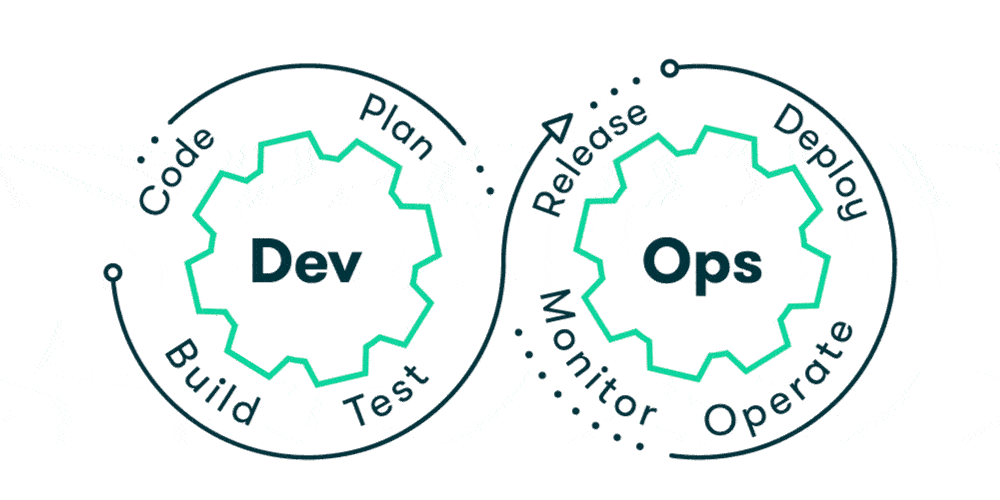
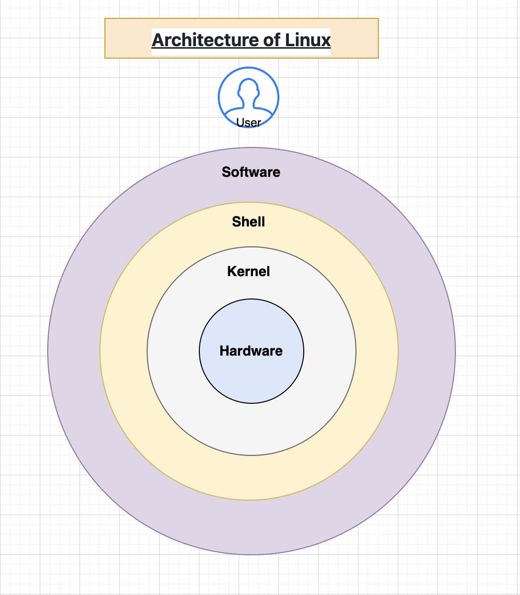

# Day-1

---

## Introduction to DevOps

### What is DevOps?

DevOps (Development + Operations) is a modern software development approach that emphasizes collaboration, automation, and integration between software developers and IT operations teams. The primary goal is to shorten the development lifecycle and enable continuous delivery of high-quality software.



### Historical Context

**Before DevOps:**
- Development and Operations teams worked in silos
- Release cycles took months or years
- Manual processes led to frequent errors
- Communication was poor between teams
- Blame culture existed when things went wrong

**After DevOps:**
- Teams work collaboratively from the start
- Releases happen multiple times per day
- Automation reduces human errors
- Shared responsibility and accountability
- Focus on continuous improvement

### Core Principles of DevOps

**1. Collaboration**
- Developers, testers, and operations work together
- Shared goals and metrics
- Open communication channels
- Joint planning and decision-making

**2. Automation**
- Automate repetitive manual tasks
- Reduce human errors
- Speed up processes (build, test, deploy)
- Enable faster feedback loops

**3. Continuous Integration (CI)**
- Developers integrate code multiple times per day
- Automated tests run on every code change
- Issues detected early
- Example: Jenkins automatically builds code when pushed to repository

**4. Continuous Deployment (CD)**
- Automated deployment to production environments
- Fast and reliable releases
- Rollback capabilities if issues occur
- Example: Code automatically deployed after passing all tests

**5. Infrastructure as Code (IaC)**
- Infrastructure defined in code (not manual setup)
- Version control for infrastructure
- Reproducible and scalable environments
- Tools: Terraform, Ansible, CloudFormation

**6. Monitoring and Logging**
- Real-time visibility into application performance
- Quick detection of issues
- Data-driven decision making
- Tools: Prometheus, Grafana, ELK Stack

**7. Feedback Culture**
- Regular feedback loops
- Learning from failures
- Continuous improvement mindset
- Retrospectives and reviews

### Benefits of DevOps

| Benefit | Explanation |
|---------|-------------|
| **Faster Time-to-Market** | Reduce time between development and production (from months to days/hours) |
| **Higher Quality** | Automated testing catches issues early |
| **Reduced Risk** | Better monitoring and quick rollback capabilities |
| **Cost Efficiency** | Automation reduces manual work; better resource utilization |
| **Employee Satisfaction** | Reduced toil; focus on meaningful work |
| **Scalability** | Infrastructure as code enables easy scaling |

---

## How IT Company Works

### Organizational Structure

```
┌─────────────────────────────────────────┐
│         IT Company Management            │
├─────────────────────────────────────────┤
│                                         │
│  ┌─────────────┐  ┌──────────────┐    │
│  │Development  │  │   Testing    │    │
│  │   Team      │  │    Team      │    │
│  └─────────────┘  └──────────────┘    │
│                                         │
│  ┌─────────────┐  ┌──────────────┐    │
│  │ Operations  │  │   Project    │    │
│  │   Team      │  │  Management  │    │
│  └─────────────┘  └──────────────┘    │
│                                         │
└─────────────────────────────────────────┘
```

### Department Responsibilities

#### 1. Development Team
**What they do:**
- Analyze client requirements
- Design software architecture
- Write code for features and functionality
- Participate in code reviews
- Fix bugs identified by testers
- Create technical documentation

**Skills Needed:**
- Programming languages (Java, Python, JavaScript, Go, etc.)
- Database design (SQL, NoSQL)
- System design principles
- Version control (Git)
- API development

**Example:** If a client needs an e-commerce website, developers write the code for product catalog, shopping cart, payment integration, etc.

---

#### 2. Testing/QA Team
**What they do:**
- Create test cases based on requirements
- Execute manual and automated tests
- Identify and document bugs
- Verify bug fixes
- Perform performance testing
- Ensure compliance with requirements

**Skills Needed:**
- Test automation (Selenium, TestNG,Postman,sonarqube)
- Manual testing techniques
- SQL for database testing
- API testing (Postman)
- Performance testing tools

**Example:** For the e-commerce website, testers verify that products display correctly, shopping cart calculations are accurate, payment processing works, etc.

---

#### 3. Operations Team
**What they do:**
- Manage servers and infrastructure
- Handle deployment processes
- Monitor application performance
- Manage databases
- Handle backups and disaster recovery
- Ensure system uptime and reliability
- Apply security patches

**Skills Needed:**
- Linux/Unix administration
- Server management
- Network management
- Database administration
- Cloud platforms (AWS, Azure)
- Automations tools (Gir,Docker,K8s,terrform,etc.)

**Example:** Operations team ensures the e-commerce website stays online 24/7, manages database backups, handles traffic spikes during sales, etc.

---

#### 4. Project Management
**What they do:**
- Gather requirements from clients
- Plan project timeline and resources
- Assign tasks to team members
- Track progress
- Manage communication with clients
- Handle risks and issues
- Ensure project stays within budget

**Skills Needed:**
- Agile/Scrum methodologies
- Communication skills
- Leadership
- Risk management
- Budget management

---

### Software Development Lifecycle (SDLC)

A typical IT company follows this process for every project:

**Phase 1: Requirements Gathering**
- Meet with clients to understand needs
- Document functional and non-functional requirements
- Create specifications document
- **Timeline:** 1-2 weeks

**Phase 2: Design**
- Architects design the solution
- Create system architecture diagrams
- Database schema design
- Create technical specifications
- **Timeline:** 1-2 weeks

**Phase 3: Development**
- Developers write code based on design
- Code committed to version control multiple times daily
- Code reviews by senior developers
- **Timeline:** 2-4 weeks (depends on complexity)

**Phase 4: Testing**
- Testers execute test cases
- Report bugs to developers
- Developers fix bugs
- Regression testing (retesting after fixes)
- **Timeline:** 1-2 weeks

**Phase 5: Deployment**
- Prepare production environment
- Deploy application to production
- Smoke testing in production
- **Timeline:** 1 day

**Phase 6: Maintenance & Support**
- Monitor application performance
- Fix issues reported by users
- Release patches and updates
- **Timeline:** Ongoing

### Common Challenges in IT Companies

**1. Slow Release Cycles**
- Testing takes weeks
- Manual deployment processes
- Approval workflows cause delays
- **Solution:** DevOps automation

**2. Poor Communication**
- Silos between teams
- Miscommunication about requirements
- Blame culture when issues occur
- **Solution:** Collaborative tools, shared goals

**3. Manual and Error-Prone Processes**
- Manual testing misses bugs
- Manual deployments cause errors
- Infrastructure setup is repetitive
- **Solution:** Automation and IaC

**4. Scalability Issues**
- Adding servers is time-consuming
- Cannot handle traffic spikes
- **Solution:** Cloud infrastructure, containerization

---

## What is an Application?

### Definition

An **application** (or app) is a software program or set of programs designed to perform specific functions or tasks for end-users, businesses, or organizations.

### Characteristics of Applications

- **Purpose-driven:** Designed to solve specific problems
- **User-centric:** Built with end-users in mind
- **Functional:** Performs specific operations
- **Maintainable:** Can be updated and improved
- **Scalable:** Can handle growth in users/data

### Types of Applications

#### 1. Web Applications
**Definition:** Applications accessed through web browsers using HTTP/HTTPS protocols

**Examples:**
- Gmail (email service)
- Google Docs (document editing)
- Facebook (social media)
- Netflix (video streaming)

**Architecture:**
```
User's Browser → Web Server → Application Server → Database
     (Client)       (Server)        (Business Logic)   (Data)
```

**Advantages:**
- No installation required
- Works on any device with a browser
- Easy to update
- Accessible from anywhere

---

#### 2. Desktop Applications
**Definition:** Applications installed directly on computers (Windows, Mac, Linux)

**Examples:**
- Microsoft Office (Word, Excel, PowerPoint)
- Adobe Photoshop (image editing)
- Visual Studio Code (code editor)
- Slack (communication)

**Advantages:**
- Better performance (local processing)
- Works offline
- Full access to system resources

**Disadvantages:**
- Requires installation on each machine
- Updates need manual installation
- Platform-specific

---

#### 3. Mobile Applications
**Definition:** Applications installed on smartphones and tablets

**Examples:**
- Instagram (social media)
- Uber (ride-sharing)
- WhatsApp (messaging)
- Pokemon Go (gaming)

**Types:**
- **Native Apps:** Built for specific OS (iOS using Swift, Android using Java/Kotlin)
- **Hybrid Apps:** Use web technologies (React Native, Flutter)

**Advantages:**
- Optimized for mobile devices
- Access to device features (camera, GPS, contacts)
- Works offline

---

#### 4. Enterprise Applications
**Definition:** Large-scale applications used by organizations for business operations

**Examples:**
- SAP (enterprise resource planning)
- Salesforce (customer relationship management)
- Oracle (database management)
- Jira (project management)

**Characteristics:**
- Serve thousands of users
- Handle massive amounts of data
- Mission-critical for businesses
- Complex and feature-rich

---

### Application Architecture

#### Monolithic Architecture
**Structure:** Entire application in one large codebase
```
┌────────────────────────────────────────┐
│      Monolithic Application             │
├────────────────────────────────────────┤
│  ┌──────────────────────────────────┐  │
│  │  User Interface (UI)             │  │
│  │  Business Logic                  │  │
│  │  Data Access Layer               │  │
│  │  Database                        │  │
│  └──────────────────────────────────┘  │
└────────────────────────────────────────┘
```

**Pros:** Simple to develop, easy to deploy
**Cons:** Hard to scale, difficult to maintain, one bug affects everything

#### Microservices Architecture
**Structure:** Application broken into small, independent services
```
┌──────────┐  ┌──────────┐  ┌──────────┐
│  User    │  │ Product  │  │ Payment  │
│ Service  │  │ Service  │  │ Service  │
└──────────┘  └──────────┘  └──────────┘
     ↓             ↓              ↓
   DB 1          DB 2           DB 3
```

**Pros:** Scalable, independent deployment, easy to maintain
**Cons:** More complex, requires DevOps expertise

---

### Application Development Lifecycle

**1. Planning**
- Understand client needs
- Define scope and features
- Estimate timeline and resources
- **Duration:** 1-2 weeks

**2. Design**
- UI/UX design (mockups, wireframes)
- System architecture design
- Database design
- API design
- **Duration:** 1-2 weeks

**3. Development**
- Write code for frontend (UI)
- Write code for backend (business logic)
- Integrate different components
- **Duration:** 2-8 weeks (depends on complexity)

**4. Testing**
- Unit testing (individual components)
- Integration testing (components together)
- System testing (entire application)
- UAT (User Acceptance Testing)
- **Duration:** 1-4 weeks

**5. Deployment**
- Prepare production environment
- Deploy application
- Monitor performance
- **Duration:** 1-2 days

**6. Maintenance**
- Fix bugs reported by users
- Add new features
- Improve performance
- **Duration:** Ongoing

---

## Developers vs Testers vs DevOps Engineers

### 1. Developers (Software Engineers)

#### Who are they?
Developers are professionals who write code to build software applications. They transform requirements into functional software.

#### Key Responsibilities
- **Code Development:** Write clean, efficient, maintainable code
- **Feature Implementation:** Build features based on requirements
- **Bug Fixing:** Fix issues reported by testers
- **Code Reviews:** Review peers' code and provide feedback
- **Documentation:** Create technical documentation
- **Optimization:** Improve code performance
- **Collaboration:** Work with testers and operations

#### Skills Required
**Programming Languages:**
- Backend: Java, Python, C++, Go, Node.js
- Frontend: JavaScript, HTML, CSS, React, Angular
- Mobile: Swift, Kotlin, Flutter, React Native

**Other Skills:**
- Database design (SQL, NoSQL)
- API development (REST, GraphQL)
- Design patterns (MVC, Singleton, Factory)
- Version control (Git/GitHub)
- Problem-solving and algorithms

#### Tools & Technologies Used
```
IDEs/Editors:
├── Visual Studio Code
├── IntelliJ IDEA
├── Eclipse
└── Sublime Text

Version Control:
├── Git
├── GitHub
├── GitLab
└── Bitbucket

Databases:
├── MySQL
├── PostgreSQL
├── MongoDB
└── Redis

Frameworks:
├── Spring Boot (Java)
├── Django (Python)
├── React (JavaScript)
└── Laravel (PHP)
```

#### Daily Tasks Example
```
9:00 AM  - Daily standup (15 min)
9:15 AM  - Code new feature for login page
10:30 AM - Code review from senior developer
11:00 AM - Fix comments from code review
12:00 PM - Lunch break
1:00 PM  - Unit testing of login feature
2:00 PM  - Commit code to GitHub
3:00 PM  - Fix bug reported by testers
4:00 PM  - Documentation
5:00 PM  - End of day
```

---

### 2. Testers (QA Engineers)

#### Who are they?
Testers are professionals who verify that software works as intended. They find bugs before users encounter them.

#### Key Responsibilities
- **Test Planning:** Plan testing strategy based on requirements
- **Test Case Design:** Create test cases covering all scenarios
- **Manual Testing:** Execute tests step-by-step
- **Automated Testing:** Write automation scripts
- **Bug Reporting:** Document bugs with detailed information
- **Regression Testing:** Retest after bug fixes
- **Performance Testing:** Test application under load
- **Documentation:** Create test reports and metrics

#### Skills Required
**Testing Knowledge:**
- Black-box testing (test without seeing code)
- White-box testing (test knowing code structure)
- API testing
- Performance/Load testing
- Security testing
- Mobile testing

**Tools & Technologies:**
- Test automation frameworks (Selenium, TestNG)
- Test management tools (TestRail, Zephyr)
- Bug tracking (Jira)
- Performance tools (JMeter, LoadRunner)
- API testing (Postman, REST Assured)

#### Example Test Case
```
Test Case: Login with Valid Credentials
────────────────────────────────────────
Precondition: User is on login page
Steps:
1. Enter valid email in email field
2. Enter valid password in password field
3. Click "Login" button
Expected Result: User logged in, redirected to dashboard
Actual Result: [To be filled during execution]
Status: PASS/FAIL
```

#### Daily Tasks Example
```
9:00 AM  - Daily standup
9:15 AM  - Review new features and requirements
10:00 AM - Create test cases for new login feature
11:00 AM - Execute test cases manually
12:00 PM - Report bugs in Jira
1:00 PM  - Lunch break
2:00 PM  - Retest fixed bugs
3:00 PM  - Execute automation tests
4:00 PM  - Performance testing
5:00 PM  - Test report generation
```

---

### 3. DevOps Engineers

#### Who are they?
DevOps engineers are professionals who bridge the gap between development and operations. They automate and optimize the entire software delivery process.

#### Key Responsibilities
- **CI/CD Pipeline:** Build and maintain automated build/test/deploy pipelines
- **Infrastructure Management:** Manage servers, networks, and cloud resources
- **Containerization:** Deploy applications using Docker/Kubernetes
- **Infrastructure as Code:** Define infrastructure in code
- **Monitoring & Logging:** Monitor application and infrastructure health
- **Security:** Implement security best practices
- **Disaster Recovery:** Ensure backup and recovery procedures
- **Performance Optimization:** Optimize infrastructure and applications
- **Cost Management:** Optimize cloud costs

#### Skills Required
**Core Skills:**
- Linux/Unix administration
- Networking and firewalls
- Cloud platforms (AWS, Azure, GCP)
- Containerization (Docker, Kubernetes)
- CI/CD tools (Jenkins, GitLab CI, GitHub Actions)
- Infrastructure as Code (Terraform, Ansible)
- Scripting (Bash, Python, Go)
- Monitoring tools (Prometheus, Grafana)
- Logging tools (ELK Stack, Splunk)

#### DevOps Tool Stack
```
Planning & Version Control:
├── Git/GitHub/GitLab
├── Jira
└── Confluence

CI/CD:
├── Jenkins
├── GitLab CI/CD
├── GitHub Actions
└── CircleCI

Containerization:
├── Docker
├── Kubernetes
└── Docker Compose

Infrastructure as Code:
├── Terraform
├── Ansible
├── CloudFormation
└── Puppet

Monitoring:
├── Prometheus
├── Grafana
├── ELK Stack
└── Datadog

Cloud Platforms:
├── AWS
├── Google Cloud
└── Microsoft Azure
```

#### DevOps Workflow Example
```
Developer pushes code → GitHub
         ↓
Webhook triggers Jenkins
         ↓
Jenkins pulls code from GitHub
         ↓
Automated Build (compile code)
         ↓
Automated Tests (unit, integration)
         ↓
Code Quality Check (SonarQube)
         ↓
Build Docker Image
         ↓
Push to Docker Registry
         ↓
Deploy to Staging (Kubernetes)
         ↓
Automated Integration Tests
         ↓
Deploy to Production
         ↓
Monitor with Prometheus/Grafana
```

#### Daily Tasks Example
```
9:00 AM  - Daily standup
9:15 AM  - Monitor production dashboards
9:30 AM  - Fix pipeline failure (Jenkins job)
10:30 AM - Write Terraform code for new AWS infrastructure
12:00 PM - Code review for infrastructure changes
1:00 PM  - Lunch break
2:00 PM  - Deploy new version to staging
3:00 PM  - Investigate production issue
4:00 PM  - Optimize Docker image
5:00 PM  - Documentation and knowledge sharing
```

---

### Detailed Comparison

#### 1. Focus & Goals

| Aspect | Developer | Tester | DevOps |
|--------|-----------|--------|--------|
| **Main Focus** | Writing code/features | Finding bugs/quality | Automation/deployment |
| **Goal** | Implement functionality | Ensure quality | Fast & reliable delivery |
| **Mindset** | Build new features | Break features | Optimize processes |
| **Success Metric** | Features delivered | Bugs found | Deployment frequency, speed |

---

#### 2. Timeline & Work Phases

| Phase | Developer | Tester | DevOps |
|-------|-----------|--------|--------|
| **Planning** | Requirements gathering | Test case design | Infrastructure planning |
| **Development** | Code new features | Design tests | Build pipelines |
| **Execution** | Implementation | Test execution | Deploy & monitor |
| **Continuous** | Ongoing coding | Ongoing testing | Always monitoring |

---

#### 3. Interaction with Other Roles

**Developer:**
```
Developers ←→ Testers (report bugs)
   ↓
Testers report bugs → Developers fix
   ↓
DevOps (deployment)
```

**Tester:**
```
Testers ← Requirements (Product Managers)
   ↓
Test Cases ↓
   ↓
Developers (code) → Testers (test)
   ↓
Testers → Developers (bug reports)
   ↓
DevOps (production validation)
```

**DevOps:**
```
Developers (code) → DevOps (automated build/test/deploy)
Testers (testing requirements) ← DevOps (test environments)
Operations (infrastructure) ← DevOps (Infrastructure as Code)
   ↓
Monitors & Alerts
```

---

#### 4. Technologies & Tools

**Developer Tools:**
- IDEs: VS Code, IntelliJ
- Languages: Java, Python, JavaScript
- Databases: MySQL, MongoDB
- Frameworks: Spring, React, Django
- Version Control: Git

**Tester Tools:**
- Automation: Selenium, TestNG, Cypress
- API Testing: Postman, REST Assured
- Performance: JMeter, LoadRunner
- Bug Tracking: Jira
- Test Management: TestRail

**DevOps Tools:**
- CI/CD: Jenkins, GitLab CI
- Containerization: Docker, Kubernetes
- IaC: Terraform, Ansible
- Monitoring: Prometheus, Grafana
- Cloud: AWS, Azure, GCP

---

#### 5. Problem-Solving Approaches

**Developer** - "How do I implement this feature?"
- Analyzes requirements
- Designs solution
- Writes code
- Tests locally
- Commits to version control

**Tester** - "How can I break this feature?"
- Analyzes requirements
- Designs test scenarios
- Creates test cases
- Executes tests
- Reports issues

**DevOps** - "How do I automate this process?"
- Analyzes deployment needs
- Designs pipeline
- Writes automation scripts
- Implements monitoring
- Optimizes performance

---

#### 6. Career Growth Paths

**Developer:**
```
Junior Developer → Senior Developer → Tech Lead → Architect
                                           ↓
                                     Engineering Manager
```

**Tester:**
```
QA Engineer → Senior QA → QA Lead → Test Architect
                               ↓
                         QA Manager
```

**DevOps:**
```
DevOps Engineer → Senior DevOps → DevOps Lead → Infrastructure Architect
                                       ↓
                               DevOps Manager/Engineering Manager
```

---

## Day-2:

## Top Features of Linux
- Open source: source code available and modifiable.
- Stability and reliability: long uptimes for servers.
- Security: strong permission model, SELinux/AppArmor support.
- Performance: efficient resource usage, suitable for servers and embedded systems.
- Package management: apt, yum, pacman for easy software install/updates.
- Variety of distributions: Ubuntu, CentOS, Fedora, Arch, etc.
- Strong networking and server tools: ssh, cron, systemd, iptables/nftables.
- Customizability: kernels, desktop environments, shells.
- Community support and documentation.

---

## Linux Everywhere
- Servers: web, database, mail, and cloud infrastructure.
- Desktops: developer and power-user environments.
- Embedded systems: routers, IoT devices, smart TVs.
- Mobile: Android uses the Linux kernel.
- Containers & orchestration: Docker, Kubernetes run on Linux.
- Supercomputers and scientific computing.

---

## Unlocking Linux Careers
- Roles: System Administrator, DevOps Engineer, Site Reliability Engineer (SRE), Cloud Engineer.
- Typical tasks: server setup, automation, monitoring, troubleshooting, security hardening.
- Entry path: learn CLI, shell scripting, networking, system internals.
- Progression: certification, specialization (containers, cloud, security).

---

## Why AWS Stands Out in the Cloud Market
- Broad service portfolio: compute, storage, database, ML, analytics, serverless.
- Global footprint: many regions and availability zones.
- Mature ecosystem: rich partner network, integrations, marketplace.
- Enterprise features: compliance, security controls, managed services.
- Scale and reliability: proven at large scale for many customers.

---

## Overview of AWS
- Core services:
  - Compute: EC2, Lambda
  - Storage: S3, EBS, EFS
  - Databases: RDS, DynamoDB
  - Networking: VPC, Route 53, CloudFront
  - Management & Monitoring: CloudWatch, CloudTrail
- Billing: pay-as-you-go, reserved and spot instances for cost savings.
- Security: IAM for identity and access control, encryption, compliance.

---

## Customer Success Stories (short examples)
- Netflix: streaming infrastructure on AWS for global scale.
- Airbnb: uses AWS for scalable backend services.
- Spotify: data processing and analytics on AWS services.
- Small startups: rapid prototyping and global rollout without heavy infra investment.

---

## Scalability and Flexibility of Business with AWS
- Auto-scaling: scale compute automatically with demand.
- Managed services: reduce operational overhead (RDS, EKS).
- Global reach: deploy applications close to users.
- Cost controls: budgeting tools, right-sizing, reserved capacity.

---

## Comparing AWS with Competitors
- AWS vs Azure vs GCP:
  - AWS: broadest service set and market maturity.
  - Azure: strong enterprise integrations, Microsoft ecosystem.
  - GCP: strong data/ML offerings and competitive pricing.
- Choice depends on requirements: services, integrations, price, existing vendor relationships.

---

## Why DevOps is a Growing Career Field
- Faster software delivery expectations from businesses.
- Need for automation, reliability, and continuous delivery.
- Cross-functional skillset valuable across industries.
- DevOps practices reduce time-to-market and operational risk.

---

## High Demand for DevOps Professionals
- Employers seek skills in CI/CD, cloud, containers, IaC, monitoring.
- Roles exist in startups to large enterprises and cloud-native companies.
- Remote and hybrid opportunities widely available.

---

## Salary Expectations and Career Growth
- Entry-level: system admin / junior DevOps — varies by region.
- Mid-level: DevOps Engineer / Cloud Engineer — significant salary increase.
- Senior-level: SRE, DevOps Lead, Cloud Architect — higher compensation and leadership roles.
- Salaries depend on region, experience, certifications, and tech stack.

---

## Skills and Expertise in DevOps
- Linux administration and scripting (Bash, Python).
- CI/CD tools: Jenkins, GitHub Actions, GitLab CI.
- Containers & orchestration: Docker, Kubernetes.
- Infrastructure as Code: Terraform, CloudFormation, Ansible.
- Cloud platforms: AWS, Azure, GCP.
- Monitoring & logging: Prometheus, Grafana, ELK.
- Networking, security best practices, and automation.

---

## Certifications and Learning Resources
- AWS: AWS Certified Cloud Practitioner, AWS Solutions Architect.
- DevOps: Certified Kubernetes Administrator (CKA), HashiCorp Terraform Associate.
- Linux: Linux Foundation Certified, CompTIA Linux+.
- Learning resources: official docs, free courses, hands-on labs (cloud free tiers), community tutorials.

---

## The Future of DevOps Careers
- Growing emphasis on SRE practices and platform engineering.
- More automation, AI-assisted operations, and GitOps adoption.
- Need for multi-cloud and security-focused DevOps skills.

---

## Goal to Achieve in CDEC
- Build foundational skills: Linux CLI, shell scripting, basic networking.
- Learn cloud basics (AWS) and core services.
- Practice CI/CD pipelines and container workflows.
- Earn at least one relevant certification (Linux / AWS / Kubernetes).
- Complete hands-on projects and labs to demonstrate practical skills.

---

## Getting Started with Operating Systems

### What is an Operating System (OS)?
- Software that manages computer hardware and provides services to applications and users.
- Acts as an intermediary between user programs and physical hardware.

### Main Responsibilities
- Process management (create, schedule, terminate processes)
- Memory management (allocate/free RAM)
- File system management (read/write, permissions)
- Device management (drivers for hardware)
- Security and access control
- User interface (CLI/GUI)

---

## Different Types of Operating Systems
- Batch OS — Executes jobs in batches (old mainframes).
- Time-Sharing / Multiuser — Many users share CPU time (e.g., Unix).
- Real-Time OS — Deterministic response for embedded systems.
- Distributed OS — Manages distributed resources across networked machines.
- Network OS — Provides network services (file/print sharing).
- Mobile OS — Optimized for phones/tablets (Android, iOS).
- Embedded OS — For appliances and IoT devices (RTOS, Embedded Linux).

---

## How Operating Systems Impact Your Daily Life
- Enable running apps (browsers, email, messaging).
- Manage smartphone operations (calls, notifications, apps).
- Provide security (user accounts, permissions, updates).
- Control home devices (routers, smart TVs) via embedded OS.
- Power cloud servers and web services people use daily.

---

## Windows vs Unix vs Linux

### Ownership and Origin
- Windows: Developed by Microsoft; proprietary.
- Unix: Originated at AT&T Bell Labs (1970s); many commercial variants (AIX, HP-UX).
- Linux: Kernel by Linus Torvalds (1991); open-source, many distributions (Ubuntu, CentOS).

### Cost and Licensing
- Windows: Commercial license; paid for many editions.
- Unix: Commercial licensing for most proprietary flavors.
- Linux: Mostly free/open-source (GPL); some enterprise distributions offer paid support.

### Security and Privacy
- Windows: Larger target for malware; frequent security updates; telemetry in some editions.
- Unix: Historically used in servers; strong POSIX security model.
- Linux: Strong permission model; active patching and community audits; customizable privacy.

### User Interface
- Windows: Graphical, user-friendly GUI; consistent UX.
- Unix: Historically CLI-first; GUIs available (X11, Wayland).
- Linux: Flexible — CLI (bash, zsh) and multiple desktop environments (GNOME, KDE).

---

## What is a Server?
- A server is a computer or program that provides services to other computers (clients) over a network.
- Examples: web server (Apache, Nginx), database server (MySQL, PostgreSQL), file server (Samba).

---

## Desktop OS vs Server OS

Desktop OS
- Optimized for interactive user experience (GUI, multimedia, peripherals).
- Examples: Windows Desktop, macOS, Ubuntu Desktop.
- Focus: user applications, responsiveness.

Server OS
- Optimized for reliability, performance, remote access and headless operation.
- Examples: Windows Server, Ubuntu Server, CentOS, RHEL.
- Focus: network services, concurrency, uptime, security.

Key differences
- GUI presence (server often headless), default services, update cadence, tuning for workloads.

---

## Introduction to Linux
- Linux refers to the kernel; common distributions bundle the kernel with GNU tools and packages.
- Popular distros: Ubuntu, Debian, Fedora, CentOS, Arch.
- Strengths: open-source, flexible, strong server adoption, container & cloud friendly.

Quick commands for students:
- Check kernel and OS:
  - uname -a
  - lsb_release -a  (may require lsb-release package)
- List processes:
  - ps aux | head
  - top or htop
- Disk and filesystems:
  - lsblk
  - df -h

---

## Architecture of Linux — Layered Notes

- Hardware
  - Physical components: CPU, RAM, disk, network cards, peripherals.
  - Provides raw resources that the kernel manages.

- Kernel
  - Core of the OS: device drivers, process scheduler, memory manager, filesystem (VFS), network stack.
  - Exposes system calls as the interface for user-space programs.
  - Runs in kernel space with full hardware access.

- Shell
  - Command-line interface that interprets user commands and scripts (examples: bash, zsh).
  - Acts as a bridge between the user and kernel (invokes system calls, launches processes).
  - Can be used interactively or for automation via scripts.

- Application
  - User-space programs (browsers, editors, daemons, services).
  - Run with limited privileges and use system calls to request kernel services.
  - Isolated from kernel space to protect system stability and security.

- User (User Layer)
  - Humans and user accounts interacting with the system via shell or GUI.
  - Owns and runs applications; subject to permission and access control enforced by kernel.
  - Includes desktop environments and user sessions.

Diagram (simple)
- Hardware ←→ Kernel (drivers, scheduler, memory) ←→ System Calls ←→ User Space (shells, services, apps)



---

## Simple Learning Exercises
1. Identify your OS:
   - uname -a
   - lsb_release -a
2. Create a file and check permissions:
   - touch ~/testfile && ls -l ~/testfile
3. View running services:
   - systemctl list-units --type=service | head
4. Explore processes:
   - ps aux --sort=-%cpu | head

---

## Quick Summary for Students
- OS manages hardware and provides a platform for apps.
- Types of OS vary by purpose (desktop, server, real-time, embedded).
- Linux is open-source, widely used on servers and in cloud environments.
- Understanding kernel, system calls, filesystem, and user space is key to Linux mastery.


# Day-4

---

## Mastering the Linux Prompt

### Understanding the Linux Command Prompt

The **Linux Command Prompt** (also called the shell prompt or terminal prompt) is the place where you type commands to interact with the Linux system. It's like a conversation with your computer — you type a command, press Enter, and the computer executes it and shows you the result.

#### What is a Prompt?

A prompt is a text indicator that appears on your terminal screen, showing that the system is ready to accept your input. It's a signal saying: "I'm ready for your command!"

#### Example of a Command Prompt:

```bash
student@linux:~$
```

This simple line contains important information. Let's break it down!

---

## Decoding the Structure of the Command Prompt

The standard Linux command prompt has a specific structure. Understanding each part helps you navigate and interact with your system more effectively.

### Standard Prompt Format:

```bash
username@hostname:current_directory$
```

Let's analyze each component:

#### 1. **Username** (`student`)

```bash
student@linux:~$
└─────┘
```

**What it shows:**
- The username of the currently logged-in user
- In this case: `student`

**Different users, different prompts:**
```bash
# When logged in as 'student' user:
student@linux:~$

# When logged in as 'root' user:
root@linux:~#

# When logged in as 'john' user:
john@linux:~$
```

**Important Distinction:**
- Regular users: prompt ends with `$`
- Root user: prompt ends with `#`

---

#### 2. **@ Symbol** (`@`)

```bash
student@linux:~$
       ↑
```

**What it means:**
- Just a separator that means "at"
- Reads as: "student at linux"
- Divides username from hostname

---

#### 3. **Hostname** (`linux`)

```bash
student@linux:~$
         └────┘
```

**What it shows:**
- The name of your computer/server
- Helps identify which machine you're connected to (important when managing multiple servers)

**Examples:**
```bash
# Local computer named 'mycomputer'
student@mycomputer:~$

# Remote server named 'webserver01'
student@webserver01:~$

# Server in cloud
student@aws-prod-server:~$
```

**Why it matters:**
- When working with multiple servers, you always know which one you're on
- Prevents accidental commands on wrong server

---

#### 4. **Colon** (`:`)

```bash
student@linux:~$
              ↑
```

**What it means:**
- Another separator
- Divides hostname from current directory

---

#### 5. **Current Directory** (`~`)

```bash
student@linux:~$
              └─
```

**What it shows:**
- Your current location in the file system
- `~` is a shortcut meaning "home directory"
- Shows where your next command will be executed

**Examples of current directories:**
```bash
# In home directory
student@linux:~$

# In /home/student/Documents
student@linux:~/Documents$

# In /var/log
student@linux:/var/log$

# In root directory
student@linux:/$

# In /etc/nginx
student@linux:/etc/nginx$
```

---

#### 6. **Prompt Symbol** (`$` or `#`)

```bash
student@linux:~$
              ↑
```

**What it shows:**
- `$` = Regular user prompt (limited permissions)
- `#` = Root/superuser prompt (full permissions)

**Examples:**
```bash
# Regular user
student@linux:~$

# Root user
root@linux:~#

# Another regular user
teacher@linux:~$

# System user
www-data@linux:~$
```

---

### Complete Prompt Breakdown Example:

```bash
student@linux:~/Documents$
└─────┘ └────┘ └──────────┘┘
  |       |         |       └─ Prompt symbol ($ = regular user)
  |       |         └─ Current directory (~/Documents)
  |       └─ Hostname (computer name)
  └─ Username (who you are)
```

**What this means:**
- User `student` is logged in
- On computer named `linux`
- Currently in the `Documents` folder inside home directory
- Ready to accept commands

---

### Real-World Prompt Examples:

#### Example 1: Regular User at Home
```bash
john@ubuntu:~$
```
- User: john
- Computer: ubuntu
- Location: home directory
- Permissions: limited (regular user)

---

#### Example 2: Root User in System Directory
```bash
root@ubuntu:/etc/nginx#
```
- User: root
- Computer: ubuntu
- Location: /etc/nginx directory
- Permissions: full (root user)

---

#### Example 3: System User Running Service
```bash
www-data@webserver01:/var/www/html$
```
- User: www-data (web server user)
- Computer: webserver01
- Location: /var/www/html (web files)
- Permissions: limited (system user)

---

#### Example 4: Different User on Different Server
```bash
admin@prod-database:/home/admin$
```
- User: admin
- Computer: prod-database (production server)
- Location: /home/admin (home directory)
- Permissions: limited (but might have sudo access)

---

## Effective Command Prompt Usage: A Step-by-Step Guide

### Step 1: Understanding the Prompt

When you see the prompt, it means:
- The system is ready to accept commands
- Your previous command has finished executing
- You can type a new command

### Step 2: Basic Command Structure

Every command follows this pattern:

```bash
command [options] [arguments]
```

#### Components:

1. **Command** — What you want to do
   ```bash
   ls          ← command to list files
   mkdir       ← command to make directory
   ```

2. **Options** — How to modify the command (usually start with `-`)
   ```bash
   ls -l       ← -l is an option (long format)
   ls -a       ← -a is an option (show all files)
   ls -la      ← combine multiple options
   ```

3. **Arguments** — What to operate on
   ```bash
   ls /home    ← /home is the argument (list this directory)
   mkdir mydir ← mydir is the argument (create this directory)
   ```

---

### Step 3: Typing and Executing Commands

**The Process:**

```bash
1. See prompt: student@linux:~$
2. Type command: ls -l /home
3. Full line: student@linux:~$ ls -l /home
4. Press Enter to execute
5. System runs command and shows output
6. New prompt appears when done
```

**Visual Example:**

```bash
student@linux:~$ ls -l /home
total 24
drwxr-xr-x 5 student student 4096 Dec  5 10:00 student
drwxr-xr-x 3 teacher teacher 4096 Dec  4 09:30 teacher

student@linux:~$ 
↑
New prompt appears - ready for next command
```

---

### Step 4: Command Examples with Explanations

#### Example 1: List Files

```bash
student@linux:~$ ls
Desktop   Documents   Downloads   Music   Pictures   Videos
```

What happened:
- Typed `ls` (list files command)
- Command executed in current directory (~)
- Shows all files and folders in home directory

---

#### Example 2: List Files with Details

```bash
student@linux:~$ ls -l
total 40
drwxr-xr-x  3 student student 4096 Dec  5 10:15 Desktop
drwxr-xr-x  2 student student 4096 Dec  4 15:30 Documents
-rw-r--r--  1 student student  1024 Dec  3 11:20 notes.txt
```

What happened:
- Typed `ls -l` (list with details)
- `-l` option shows:
  - Permissions
  - Owner
  - File size
  - Date/time created

---

#### Example 3: Change Directory

```bash
student@linux:~$ cd Documents
student@linux:~/Documents$
```

What happened:
- Typed `cd Documents` (change directory)
- Moved into Documents folder
- Prompt changed to show new location (`~/Documents`)

---

#### Example 4: Create Directory

```bash
student@linux:~/Documents$ mkdir my_project
student@linux:~/Documents$ ls
my_project
```

What happened:
- Typed `mkdir my_project` (make directory)
- Created new folder called `my_project`
- `ls` shows the new folder exists

---

#### Example 5: Create File

```bash
student@linux:~/Documents$ touch hello.txt
student@linux:~/Documents$ ls -l
-rw-r--r-- 1 student student 0 Dec  5 10:30 hello.txt
```

What happened:
- Typed `touch hello.txt` (create file)
- Created empty file called `hello.txt`
- `ls -l` shows the file with its details

---

### Step 5: Understanding Command Output

After executing a command, you see:
1. **Command output** — Information the command returns
2. **New prompt** — Indicates command finished, ready for next one

```bash
student@linux:~$ pwd
/home/student
↑
Output: your current directory path

student@linux:~$
↑
New prompt appears - command completed
```

---

### Step 6: Error Handling

When you make a mistake, you get an error message:

```bash
student@linux:~$ cd nonexistent_folder
bash: cd: nonexistent_folder: No such file or directory
student@linux:~$
```

What happened:
- Tried to change to folder that doesn't exist
- System shows error message
- Prompt reappears
- You can try again

---

### Step 7: Command History

The system remembers your previous commands:

```bash
student@linux:~$ history
    1  ls
    2  cd Documents
    3  ls -l
    4  mkdir my_project
    5  touch hello.txt
student@linux:~$
```

**How to use history:**
```bash
# See last 10 commands
history 10

# Run a previous command using number
!2          ← runs command #2 (cd Documents)

# Run last command that starts with 'ls'
!ls

# Go through commands with arrow keys
↑ (up arrow)   ← previous command
↓ (down arrow) ← next command
```

---

### Step 8: Using Tab Completion

**Tab Completion** automatically completes your typing:

```bash
# Start typing:
student@linux:~$ cd Doc

# Press Tab, it auto-completes:
student@linux:~$ cd Documents$

# Saves time and prevents typos!
```

**How to use it:**
- Type first few letters of command or filename
- Press Tab key
- System completes it (if unambiguous)
- If multiple matches, press Tab twice to see all options

---

## Making the Command Prompt Your Own: Customization Tips (Advanced Concept)

### What Can You Customize?

You can change how your prompt looks and behaves by editing configuration files.

---

### Understanding the PS1 Variable

The prompt is controlled by a special variable called `PS1` (Prompt String 1).

#### View Current Prompt:

```bash
student@linux:~$ echo $PS1
\u@\h:\w$
```

This shows the prompt template.

---

### Prompt Variables Explained

| Variable | Shows | Example |
|----------|-------|---------|
| `\u` | Username | student |
| `\h` | Hostname | linux |
| `\w` | Current directory | ~/Documents |
| `\d` | Date | Wed Dec  5 |
| `\t` | Time (HH:MM:SS) | 10:30:45 |
| `\T` | Time (12-hour) | 10:30:45 AM |
| `\$` | $ or # symbol | $ (for user) or # (for root) |
| `\n` | New line | (starts on new line) |

---

### Example Customizations

#### Example 1: Simple Colored Prompt

```bash
# Edit the .bashrc file (configuration file)
nano ~/.bashrc

# Find the line with PS1= and change it to:
export PS1="\u@\h:\w\$ "

# Save and reload
source ~/.bashrc
```

#### Example 2: Colored Prompt with Time

```bash
# Add this to ~/.bashrc
export PS1="[\t] \u@\h:\w$ "
```

This shows:
```bash
[10:30:45] student@linux:~/Documents$
```

---

#### Example 3: Prompt with Colors

```bash
# Add to ~/.bashrc (advanced)
export PS1="\e[32m\u@\h\e[0m:\w$ "
```

This makes username green.

---

#### Example 4: Multi-line Prompt

```bash
# Add to ~/.bashrc
export PS1="\u@\h\n\w$ "
```

Shows as:
```bash
student@linux
~/Documents$
```

---

### How to Make Changes Permanent

1. **Open configuration file:**
   ```bash
   nano ~/.bashrc
   ```

2. **Find the PS1 line:**
   ```bash
   # Search for: PS1=
   ```

3. **Edit or add new PS1:**
   ```bash
   export PS1="your_custom_prompt_here"
   ```

4. **Save (Ctrl+O, Enter, Ctrl+X)**

5. **Reload configuration:**
   ```bash
   source ~/.bashrc
   ```

6. **See changes immediately:**
   ```bash
   # Your prompt should now look different!
   ```

---

### Useful Customizations for Students

#### Simple and Professional:
```bash
export PS1="\u@\h:\w$ "
```

#### With Git Branch (if in git directory):
```bash
export PS1="\u@\h:\w\$(git branch 2>/dev/null | grep '^\*' | colrm 1 2) $ "
```

#### With Current Date:
```bash
export PS1="\d \u@\h:\w$ "
```

#### Minimal and Clean:
```bash
export PS1="\w$ "
```

---

## Introduction to Linux Basic Commands

Now that you understand the prompt, let's learn essential Linux commands!

### Command Categories

1. **File and Directory Commands**
2. **Text Commands**
3. **System Information Commands**
4. **File Content Commands**
5. **Help Commands**

---

## Getting Started with the Linux Terminal

### What is the Terminal?

The terminal is the application window where you see the command prompt and type commands. It's your interface to the Linux command line.

### Opening Terminal

#### On Ubuntu/Debian:
- Right-click on desktop → "Open Terminal Here"
- Or press Ctrl+Alt+T
- Or search for "Terminal" in applications menu

#### On Other Systems:
- Find the Terminal or Console application
- Or SSH into a remote Linux server

---

### Terminal vs Prompt

| Term | Meaning |
|------|---------|
| **Terminal** | The application window |
| **Prompt** | The text line where you type |
| **Shell** | The program that interprets commands |
| **Command Line** | Where you type commands |

---

### First Steps in Terminal

When you open terminal:

```bash
student@linux:~$
```

1. You see your prompt
2. Cursor blinks (ready for input)
3. Type your command
4. Press Enter to execute

---

## Essential System Information: Commands and Tools for Linux

### Understanding System Information

System information tells you about your computer: CPU, RAM, disk space, OS version, etc.

---

### Command 1: `uname` — Unix Name

**Purpose:** Display system information

**Basic Usage:**
```bash
student@linux:~$ uname
Linux
```

**Shows:**
- The kernel name (Linux, Darwin for Mac, etc.)

---

**Detailed Information:**
```bash
student@linux:~$ uname -a
Linux ubuntu 5.15.0-84-generic #94-Ubuntu SMP Fri Oct 7 00:24:33 UTC 2022 x86_64 GNU/Linux
```

**Options:**
- `-a` — All information (kernel, hostname, kernel version, processor type)
- `-s` — Kernel name only
- `-r` — Kernel release
- `-v` — Kernel version
- `-m` — Machine hardware name (x86_64, ARM, etc.)

**What each part means:**
```
Linux              ← Kernel name
ubuntu             ← Hostname
5.15.0-84-generic  ← Kernel version
#94-Ubuntu         ← Build number
x86_64             ← Architecture (64-bit processor)
GNU/Linux          ← Operating system
```

---

### Command 2: `lsb_release` — Linux Standard Base Release

**Purpose:** Show Linux distribution information

**Basic Usage:**
```bash
student@linux:~$ lsb_release -a
No LSB modules are available.
Distributor ID: Ubuntu
Release:        20.04
Codename:       focal
```

**Options:**
- `-a` — All information
- `-d` — Distribution description
- `-r` — Release number
- `-c` — Codename

**What it shows:**
- Distributor: Which Linux distribution (Ubuntu, CentOS, etc.)
- Release: Version number (20.04, 22.04, etc.)
- Codename: Code name for that version (focal, jammy, etc.)

---

### Command 3: `whoami` — Who Am I

**Purpose:** Show the current logged-in user

**Usage:**
```bash
student@linux:~$ whoami
student
```

**Shows:**
- Your username

**When to use:**
- Verify which user account you're using
- Especially useful when logged into multiple systems

---

### Command 4: `id` — Identity

**Purpose:** Show user and group IDs

**Basic Usage:**
```bash
student@linux:~$ id
uid=1000(student) gid=1000(student) groups=1000(student),27(sudo),999(docker)
```

**What it shows:**
- `uid` — User ID number (1000)
- `gid` — Group ID number (1000)
- `groups` — All groups you belong to

**Detailed Breakdown:**
```
uid=1000(student)        ← User ID 1000, username is student
gid=1000(student)        ← Primary group ID 1000, group name is student
groups=1000(student)     ← Member of student group
       27(sudo)          ← Member of sudo group (can use sudo)
       999(docker)       ← Member of docker group
```

---

### Command 5: `hostname` — Computer Name

**Purpose:** Show or change the computer's name

**Usage:**
```bash
student@linux:~$ hostname
linux
```

**Shows:**
- Your computer's hostname

**Change hostname (requires sudo):**
```bash
sudo hostname newname
```

---

### Command 6: `pwd` — Print Working Directory

**Purpose:** Show your current directory

**Usage:**
```bash
student@linux:~$ pwd
/home/student
```

**Shows:**
- Your exact location in the file system

**Examples:**
```bash
# In home directory
student@linux:~$ pwd
/home/student

# In Documents folder
student@linux:~/Documents$ pwd
/home/student/Documents

# In system directory
student@linux:/etc$ pwd
/etc
```

---

### Command 7: `ls` — List Directory Contents

**Purpose:** Show files and folders

**Basic Usage:**
```bash
student@linux:~$ ls
Desktop   Documents   Downloads   Music   Pictures   Videos
```

**Common Options:**
```bash
# Long format with details
student@linux:~$ ls -l

# Show hidden files (starting with .)
student@linux:~$ ls -a

# Combined options
student@linux:~$ ls -la

# Show human-readable file sizes
student@linux:~$ ls -lh

# Sort by modification time
student@linux:~$ ls -lt

# Show only directories
student@linux:~$ ls -d */
```

**Output Explanation (ls -l):**
```bash
-rw-r--r-- 1 student student 1024 Dec 5 10:30 file.txt
│  │  │
│  │  └─ Others can read (r)
│  └──── Group can read (r)
└─────── Owner can read/write (rw)
```

---

### Command 8: `df` — Disk Free

**Purpose:** Show disk space usage

**Basic Usage:**
```bash
student@linux:~$ df
Filesystem     1K-blocks    Used Available Use% Mounted on
/dev/sda1      102081528 45032120 52309292  47% /
```

**Better Format:**
```bash
student@linux:~$ df -h
Filesystem      Size  Used Avail Use% Mounted on
/dev/sda1        98G   45G   50G  47% /
```

**What it shows:**
- `Filesystem` — Storage device name
- `Size` — Total disk space
- `Used` — Space used
- `Avail` — Space available
- `Use%` — Percentage used
- `Mounted on` — Where it's connected

---

### Command 9: `du` — Disk Usage

**Purpose:** Show how much space directories use

**Usage:**
```bash
student@linux:~$ du -sh ~/Documents
2.5G    /home/student/Documents
```

**Shows:**
- Total size of a directory

**Options:**
- `-s` — Summary (total only)
- `-h` — Human-readable (K, M, G)

**Examples:**
```bash
# Size of current directory
student@linux:~$ du -sh .
1.5G    .

# Size of all subdirectories
student@linux:~$ du -sh */
512M    Desktop
1.2G    Documents
256M    Downloads
```

---

### Command 10: `free` — Memory Information

**Purpose:** Show RAM usage

**Usage:**
```bash
student@linux:~$ free -h
              total        used        free      shared  buff/cache   available
Mem:          7.7Gi       2.3Gi       1.2Gi      256Mi       4.2Gi       4.9Gi
Swap:         2.0Gi       0B          2.0Gi
```

**What it shows:**
- `total` — Total RAM installed (7.7 GB)
- `used` — RAM being used (2.3 GB)
- `free` — Available RAM (1.2 GB)
- `buff/cache` — Cache memory (4.2 GB)
- `available` — Usable memory (4.9 GB)

**Swap:**
- Extension of RAM using hard disk
- Used when RAM is full

---

### Command 11: `top` — System Monitor

**Purpose:** Show running processes and system stats

**Usage:**
```bash
student@linux:~$ top
```

**Shows:**
- Running processes
- CPU usage
- Memory usage
- Process IDs
- User running each process

**How to exit:**
- Press `q` to quit

**Key Information:**
- `PID` — Process ID
- `USER` — User running the process
- `%CPU` — CPU usage percentage
- `%MEM` — Memory usage percentage
- `COMMAND` — Program name

---

### Command 12: `ps` — Process Status

**Purpose:** Show running processes (snapshot)

**Basic Usage:**
```bash
student@linux:~$ ps
  PID TTY      STAT   TIME COMMAND
 1234 pts/0    Ss   0:00 bash
 1245 pts/0    R+   0:00 ps
```

**Better Usage:**
```bash
student@linux:~$ ps aux
```

**Shows all processes with details:**
```bash
USER       PID %CPU %MEM    VSZ   RSS TTY STAT START   TIME COMMAND
root         1  0.0  0.1  43896  6908 ?   Ss   10:00   0:05 /sbin/init
student   1234  0.0  0.2  21540  9876 pts/0 Ss 10:05   0:00 bash
student   1245  0.0  0.1  38900  6500 pts/0 R+ 10:30   0:00 ps aux
```

**Useful Options:**
```bash
# Find a specific process
ps aux | grep python

# Sort by CPU usage
ps aux --sort=-%cpu

# Show process tree
ps aux --forest
```

---

### Command 13: `uptime` — System Uptime

**Purpose:** Show how long system has been running

**Usage:**
```bash
student@linux:~$ uptime
 10:30:45 up 5 days, 3:45, 2 users, load average: 0.45, 0.52, 0.48
```

**What it shows:**
- `10:30:45` — Current time
- `up 5 days, 3:45` — System running for 5 days, 3 hours, 45 minutes
- `2 users` — Number of logged-in users
- `load average` — System load (CPU usage)

---

### Command 14: `date` — Current Date and Time

**Purpose:** Show current date and time

**Usage:**
```bash
student@linux:~$ date
Wed Dec  5 10:30:45 UTC 2024
```

**Custom Format:**
```bash
# Show date only
student@linux:~$ date +%Y-%m-%d
2024-12-05

# Show time only
student@linux:~$ date +%H:%M:%S
10:30:45

# Custom format
student@linux:~$ date "+%A, %B %d, %Y"
Wednesday, December 05, 2024
```

---

### Command 15: `which` — Locate Command

**Purpose:** Show where a command is located

**Usage:**
```bash
student@linux:~$ which python
/usr/bin/python

student@linux:~$ which ls
/bin/ls

student@linux:~$ which gcc
/usr/bin/gcc
```

**Shows:**
- The full path to the executable file

---

### Command 16: `man` — Manual Pages

**Purpose:** Get help for any command

**Usage:**
```bash
student@linux:~$ man ls
LS(1)                            User Commands                           LS(1)

NAME
       ls - list directory contents

SYNOPSIS
       ls [OPTION]... [FILE]...

DESCRIPTION
       List information about the FILEs...
```

**How to use:**
- `Space` — Page down
- `q` — Quit
- `/keyword` — Search
- `n` — Next match

**Examples:**
```bash
# Learn about ls command
man ls

# Learn about mkdir
man mkdir

# Learn about file permissions
man chmod
```

---

### Command 17: `type` — Command Type

**Purpose:** Show what type of command it is

**Usage:**
```bash
student@linux:~$ type ls
ls is aliased to `ls --color=auto'

student@linux:~$ type pwd
pwd is a shell builtin

student@linux:~$ type python
python is /usr/bin/python
```

**Shows:**
- If it's an alias
- If it's a built-in shell command
- If it's an external program (and where)

---

## Quick Reference: Essential Commands Summary

```bash
# System Information
uname -a              # Kernel and system info
lsb_release -a        # Linux distribution info
whoami                # Current user
id                    # User and group IDs
hostname              # Computer name
uptime                # System uptime
date                  # Current date and time

# Directory and Files
pwd                   # Print working directory
ls                    # List files
ls -l                 # List with details
ls -la                # List with hidden files
df -h                 # Disk space usage
du -sh                # Directory size

# Memory and Processes
free -h               # Memory usage
top                   # Real-time process monitor
ps aux                # Show all processes
ps aux | grep python  # Find specific process

# Help and Location
which command         # Find command location
man command           # Show command manual
type command          # Show command type
```

---

## Hands-On Exercises for Students

### Exercise 1: Explore Your System

```bash
# 1. Check your username
whoami

# 2. See your user ID and groups
id

# 3. Check your current location
pwd

# 4. See your Linux distribution
lsb_release -a

# 5. Check system uptime
uptime
```

---

### Exercise 2: Check Disk and Memory

```bash
# 1. See disk space
df -h

# 2. Check a specific directory size
du -sh ~/Documents

# 3. Check RAM usage
free -h

# 4. See which processes use most memory
top
```

---

### Exercise 3: Find and Learn About Commands

```bash
# 1. Find where ls command is
which ls

# 2. Get help about ls
man ls

# 3. Find python installation
which python

# 4. List all processes
ps aux | head
```

---

### Exercise 4: Customize Your Prompt

```bash
# 1. See current prompt setting
echo $PS1

# 2. Edit configuration
nano ~/.bashrc

# 3. Find PS1= line and change to:
export PS1="\u@\h:\w\$ "

# 4. Save and reload
source ~/.bashrc

# 5. See your new prompt!
```

---

## Common Command Usage Patterns

### Pattern 1: View Information About System

```bash
student@linux:~$ uname -a
student@linux:~$ lsb_release -a
student@linux:~$ whoami
```

### Pattern 2: Check Resource Usage

```bash
student@linux:~$ df -h
student@linux:~$ du -sh .
student@linux:~$ free -h
student@linux:~$ top
```

### Pattern 3: Monitor Processes

```bash
student@linux:~$ ps aux
student@linux:~$ ps aux | grep python
student@linux:~$ top
```

### Pattern 4: Get Help

```bash
student@linux:~$ man ls
student@linux:~$ which python
student@linux:~$ type python
```

---

## Key Takeaways for Students

1. **Prompt Structure:** `username@hostname:directory$`
   - Shows who you are, where you are, and what machine

2. **Command Execution:** Type command → Press Enter → See output → New prompt

3. **Navigation:** Use `pwd` to see location, `cd` to change location

4. **System Info:** Use commands like `uname`, `df`, `free`, `top` to check system

5. **Getting Help:** Use `man command` to learn about any command

6. **Tab Completion:** Use Tab to auto-complete commands and filenames

7. **Command History:** Use arrow keys or `history` to recall previous commands

8. **Customization:** Edit `~/.bashrc` to customize your prompt and environment

# Day-5


## Delving Deep into the Linux File System — Practical Notes for Students

This chapter teaches everyday file-system operations you will use frequently: how to move around, create and manage files/directories, view and edit file contents, and safely copy/move/delete files. Each section contains commands and simple examples you can try in the terminal.

---

## 1. Navigating the File System

Purpose: find where you are, list contents, and move between folders.

Basic commands
- Print current directory:
  ```bash
  pwd
  # Example output: /home/rajat
  ```
- List files and directories:
  ```bash
  ls
  ls -l        # long listing: permissions, owner, size, date
  ls -la       # include hidden files (those starting with .)
  ls -lh       # human-readable sizes (K, M, G)
  ```
- Change directory:
  ```bash
  cd /path/to/dir
  cd ~         # go to your home directory
  cd -         # go to previous directory
  cd ..        # go up one level (parent)
  ```
- Show tree view (install if needed: apt install tree):
  ```bash
  tree -L 2 ~/projects
  ```
- Quick navigation helpers:
  - `Tab` for auto-completion of filenames and directories.
  - `pushd /path` and `popd` to use a directory stack (helpful when switching contexts).
  - `cd -` returns to the last directory.

Example session:
```bash
pwd                  # /home/rajat
ls -la               # show files, including .bashrc
cd Documents
pwd                  # /home/rajat/Documents
cd ~/projects/myapp
```

---

## 2. File and Directory Management

Create, inspect, rename, change ownership, and set permissions.

- Create directory:
  ```bash
  mkdir mydir
  mkdir -p parent/child/grandchild   # -p creates parents as needed
  ```
- Remove directory:
  ```bash
  rmdir emptydir       # only removes if directory is empty
  rm -r dir_to_remove  # recursive delete (use with care)
  ```
- Create an empty file (or update timestamp):
  ```bash
  touch notes.txt
  ```
- Rename or move files/directories:
  ```bash
  mv oldname.txt newname.txt
  mv ~/downloads/report.pdf ~/documents/  # move file to folder
  ```
- Copy files and directories:
  ```bash
  cp file.txt /path/to/destination/
  cp -r myproject/ ~/backup/myproject/    # copy directory recursively
  ```
- Inspect file or directory metadata:
  ```bash
  stat file.txt
  ls -l file.txt
  ```
- Change permissions:
  ```bash
  chmod 644 file.txt      # rw-r--r--
  chmod +x script.sh      # make executable
  ```
- Change owner and group (requires sudo for other users):
  ```bash
  sudo chown rajat:staff /var/www/html -R
  ```

Safety tip: always `ls` the path before `rm -r`. Use `echo` to preview destructive commands:
```bash
echo rm -rf /some/path
```

---

## 3. Viewing and Editing Files

Quickly read files, follow logs, search inside files, and edit content.

- View entire file:
  ```bash
  cat file.txt
  ```
- Page through long files:
  ```bash
  less /var/log/syslog    # use Space to page, / to search, q to quit
  ```
- Show start or end of file:
  ```bash
  head -n 20 file.txt     # first 20 lines
  tail -n 20 file.txt     # last 20 lines
  tail -f /var/log/syslog # follow new lines in real time
  ```
- Search inside files:
  ```bash
  grep 'ERROR' app.log
  grep -Ri 'TODO' ~/projects
  ```
- Simple edits (text editors):
  - nano (beginner friendly)
    ```bash
    nano ~/projects/notes.md
    ```
  - vim (power user — steeper learning curve)
    ```bash
    vim ~/scripts/deploy.sh
    ```
- Quick text transformations:
  ```bash
  sed -n '1,50p' file.txt         # show lines 1-50
  awk '{print $1, $3}' data.csv   # print columns 1 and 3
  ```

Example: inspect and follow a web server log
```bash
sudo less /var/log/nginx/error.log
# or follow in real time
sudo tail -f /var/log/nginx/error.log
```

Always back up configuration files before editing:
```bash
sudo cp /etc/nginx/nginx.conf /etc/nginx/nginx.conf.bak
sudo nano /etc/nginx/nginx.conf
# after changes:
sudo systemctl reload nginx
```

---

## 4. Copy, Move, and Delete Files — Practical Patterns

Common operations and safer alternatives.

Copying
- Basic copy:
  ```bash
  cp source.txt destination.txt
  ```
- Preserve attributes (mode, timestamps, links):
  ```bash
  cp -a /source/dir /dest/dir
  ```
- Use rsync for large or repeated copies (recommended):
  ```bash
  rsync -avh --progress ~/projects/myapp/ ~/backup/myapp/
  ```

Moving / Renaming
- Move or rename:
  ```bash
  mv file.txt /other/place/
  mv oldname.txt newname.txt
  ```
- Move directory:
  ```bash
  mv ~/downloads/myfolder ~/projects/
  ```

Deleting (be careful!)
- Remove a single file:
  ```bash
  rm filename.txt
  ```
- Remove multiple files:
  ```bash
  rm file1 file2 file3
  ```
- Recursive and force remove (dangerous):
  ```bash
  rm -rf /path/to/dir
  ```
  - Double-check path; avoid running as root unless necessary.

Safer delete workflow
1. List files to confirm:
   ```bash
   ls -la /path/to/dir
   ```
2. Use `trash` / `gio trash` (desktop environments) or move to a temporary folder:
   ```bash
   mkdir -p ~/trash; mv ~/projects/oldproj ~/trash/
   ```
3. When certain, remove permanently.

Example: backup, then remove
```bash
cp -r ~/projects/demo ~/backup/demo-$(date +%F)
rm -rf ~/projects/demo
```

---

## 5. Quick Exercises (Try in your terminal)

1. Navigate and inspect:
   ```bash
   pwd
   ls -la
   cd /tmp
   mkdir -p ~/lab/demo
   ```
2. Create, edit, and view:
   ```bash
   touch ~/lab/demo/notes.txt
   echo "First note" > ~/lab/demo/notes.txt
   cat ~/lab/demo/notes.txt
   nano ~/lab/demo/notes.txt   # add another line, save
   ```
3. Copy and verify:
   ```bash
   cp -a ~/lab/demo ~/lab/demo-backup
   ls -la ~/lab
   ```
4. Safe remove:
   ```bash
   mv ~/lab/demo ~/lab/demo-to-delete
   ls -la ~/lab
   # after confirming contents:
   rm -r ~/lab/demo-to-delete
   ```

---

## 6. Quick Reference Cheat-sheet

Navigation:
- pwd, ls, ls -la, cd, cd -, tree

Create / Remove:
- mkdir -p, rmdir, rm -r (use safely), touch

Inspect:
- stat, ls -l, file, du -sh, df -h

View & Search:
- cat, less, head, tail, tail -f, grep -R

Edit:
- nano, vim, sed, awk

Copy / Move:
- cp, cp -r, cp -a, rsync -avh, mv

Permissions & Ownership:
- chmod, chown, chgrp

Safety:
- Always verify with ls before rm
- Backup config files before editing
- Prefer rsync for large or incremental copies

---

# Day-6


## Mastering the Linux File System Hierarchy

### Mastering the Linux File System — 19 important directories

- / (root)
  - The top of the filesystem tree. All paths start here.
  - Example: ls -ld /

- /bin
  - Essential user binaries (commands) required for single-user mode and for all users (ls, cp, mv).
  - Example: ls -l /bin/ls

- /boot
  - Files required to boot the system: kernel, initramfs, bootloader config.
  - Example: ls -l /boot

- /dev
  - Device files representing hardware and virtual devices (e.g., /dev/sda).
  - Example: ls -l /dev/sda*

- /etc
  - System-wide configuration files and startup scripts.
  - Example: ls -la /etc | head

- /home
  - Users' personal directories (e.g., /home/rajat).
  - Example: ls -la /home

- /lib
  - Shared libraries required by binaries in /bin and /sbin (32-bit systems).
  - Example: ls -l /lib | head

- /lib64
  - 64-bit shared libraries on 64-bit systems.
  - Example: ls -l /lib64 | head

- /media
  - Mount points for removable media (USB CDs) created automatically (GUI systems).
  - Example: ls -la /media

- /mnt
  - Temporary mount point for administrators (manual mounts).
  - Example: sudo mount /dev/sdb1 /mnt; ls /mnt

- /opt
  - Optional add-on application packages (third-party software).
  - Example: ls -l /opt

- /proc
  - Virtual filesystem providing process and kernel information (procfs).
  - Example: cat /proc/cpuinfo

- /root
  - Home directory for the root user (not the same as /).
  - Example: ls -la /root

- /run
  - Runtime data since boot (sockets, pids); volatile.
  - Example: ls -la /run

- /sbin
  - System binaries for administration (fdisk, ifconfig) — usually run by root.
  - Example: ls -l /sbin

- /srv
  - Data for services provided by the system (WWW, FTP data).
  - Example: ls -la /srv

- /sys
  - Virtual filesystem exposing kernel objects and device tree (sysfs).
  - Example: ls -la /sys/class/net

- /tmp
  - Temporary files — world-writable, often cleared at reboot.
  - Example: ls -la /tmp

- /var
  - Variable data: logs (/var/log), mail, spool files, package caches.
  - Example: ls -la /var/log

---

## The Significance of the Linux File System Hierarchy

- Predictability: standard locations make it easy to find binaries, configs, and logs.
- Separation of concerns: isolates user data, system files, runtime data, and optional software.
- Permissions & security: directories have differing default permissions and purposes.
- Maintainability: backups, package management, and recovery are simpler with a consistent layout.

---

## Inside the Linux Root Directory: What You Need to Know

- Root (/) contains mount points and top-level directories — do not store user files directly in /.
- Mounted filesystems (external disks, network mounts) appear at mount points (e.g., /mnt, /media).
- Virtual filesystems (/proc, /sys, /run) are kernel-provided views — read-only or volatile.
- Lost+found: usually present on filesystems formatted with ext{2,3,4}; stores recovered file fragments after fsck.
- Use ls -ld and stat to inspect ownership, perms, and mount points:
  - stat /

---

## Understanding the Functionality of Common Linux Directories (quick guide)

- Binaries: /bin, /sbin, /usr/bin, /usr/sbin
  - User vs system admin tools; /usr/* holds larger collections installed by packages.
- Libraries: /lib, /lib64, /usr/lib
  - Shared code used by binaries.
- Configuration: /etc
  - Centralized system configuration; backup before editing.
- User data: /home, /root
  - Personal files and settings per user.
- Variable & logs: /var (logs, spools, caches)
  - Monitor /var/log for troubleshooting.
- Boot & kernel: /boot
  - Kernel images and bootloader files.
- Devices & runtime: /dev, /proc, /sys, /run
  - Device nodes, process info, kernel object interfaces, and runtime state.
- Optional & service data: /opt, /srv
  - Third-party apps and service-specific content.
- Temporary: /tmp
  - Short-lived files; safe to clean periodically.

---

## Introduction to Linux Shortcuts: Boost Your Efficiency

- ~ (tilde)
  - Shortcut for current user's home directory.
  - Example: cd ~ or cd ~/projects

- / (root)
  - Absolute path starts at root: cd /etc

- . (dot)
  - Current directory. Useful in commands: ./script.sh

- .. (double dot)
  - Parent directory. Example: cd ..

- - (dash)
  - Previous directory. Example: cd -  (switch back)

- Tab completion
  - Press Tab to auto-complete commands, filenames, and paths.

- Ctrl+R (reverse search)
  - Interactive history search to find previous commands.

- Ctrl+C and Ctrl+Z
  - Ctrl+C: kill running foreground process.
  - Ctrl+Z: suspend process (use bg/fg to resume).

- pushd / popd / dirs
  - Directory stack for quick navigation.
  - Example: pushd /var/log; popd

- Aliases
  - Short commands: alias ll='ls -lah'
  - Add to ~/.bashrc to persist.

- Symbolic links
  - Create shortcuts inside filesystem: ln -s /path/to/target ~/shortcut

---

## Hands-on Exercises (short)

1. List top-level directories and permissions:
   - ls -la /
2. Check mount points and disks:
   - lsblk; mount | grep '^/dev'
3. Inspect kernel and process info:
   - cat /proc/cpuinfo | head
4. Use shortcuts:
   - cd ~; mkdir -p ~/lab; pushd /var/log; popd; cd -
5. Create an alias and persist it:
   - echo "alias ll='ls -lah'" >> ~/.bashrc; source ~/.bashrc

---

## Quick Reference (commands)

- Inspect directories:
  - ls -la /path
  - stat /path
- Disk & mounts:
  - lsblk
  - df -h
  - mount
- Virtual fs:
  - ls /proc
  - ls /sys
- Links:
  - ln -s /target /link
- Shortcuts:
  - cd ~, cd -, cd .., Tab, Ctrl+R

# Day-7


## Mastering Text Editing with VIM

### Overview of Vim and its History

**What is Vim?**
Vim (short for "Vi IMproved") is a powerful text editor that runs in the terminal. It's designed for fast and efficient text editing, especially for programmers and system administrators. Unlike simple editors like Notepad, Vim uses different "modes" to do different tasks, which might feel strange at first but becomes very powerful once you learn it.

**Why Use Vim?**
- **Speed:** Edit text quickly without a mouse.
- **Everywhere:** Available on almost every Linux system (and many others).
- **Powerful:** Supports advanced features like macros, plugins, and scripting.
- **Lightweight:** No fancy GUI needed, just runs in the terminal.

**History:**
- Vim is based on an older editor called Vi, created in 1976 by Bill Joy for Unix systems.
- Bram Moolenaar created Vim in 1991 as an improved version of Vi.
- Vim is free, open-source software and is the default editor on many Linux distributions.
- It's widely used in programming because it's efficient for handling code.

**Getting Started:**
- Install if needed: `sudo apt install vim` (on Ubuntu/Debian)
- Open a file: `vim filename.txt`
- Vim starts in "Normal mode" (also called Command mode).

---

### Basic Concepts: Modes in Vim

Vim works in different "modes," each for a specific purpose. This is the key to Vim's power. You switch between modes using keys.

#### 1. **Normal Mode (Command Mode)**
   - **Purpose:** Navigate, manipulate text, and run commands.
   - **Default Mode:** Vim opens here.
   - **Indicator:** No special message; cursor is a block.
   - **Common Actions:** Moving around, deleting text, copying/pasting.

#### 2. **Insert Mode**
   - **Purpose:** Type and edit text like a regular editor.
   - **How to Enter:** Press `i`, `a`, `o`, etc. (explained later).
   - **Indicator:** Cursor becomes thin; "-- INSERT --" appears at the bottom.
   - **Common Actions:** Typing text, basic editing.

#### 3. **Visual Mode**
   - **Purpose:** Select text for operations (like highlighting).
   - **How to Enter:** Press `v` (character), `V` (line), or `Ctrl+v` (block).
   - **Indicator:** Selected text is highlighted; "-- VISUAL --" at bottom.
   - **Common Actions:** Select and operate on blocks of text.

#### 4. **Command-Line Mode (Execute Mode)**
   - **Purpose:** Run advanced commands, save files, quit, etc.
   - **How to Enter:** Press `:` in Normal mode.
   - **Indicator:** `:` appears at bottom with cursor.
   - **Common Actions:** `:w` (save), `:q` (quit), `:wq` (save and quit).

**Key Tip:** Always go back to Normal mode (press `Esc`) before switching to another mode. This is how Vim stays efficient!

---

### Basic Navigation in Command Mode

In Normal mode, use keys to move the cursor. No mouse needed!

#### Basic Movement:
- `h` — Move left (one character)
- `j` — Move down (one line)
- `k` — Move up (one line)
- `l` — Move right (one character)

**Remember:** `h`, `j`, `k`, `l` are like arrow keys (left, down, up, right).

#### Word Navigation:
- `w` — Move to start of next word
- `b` — Move to start of previous word
- `e` — Move to end of current word

#### Line Navigation:
- `0` — Go to beginning of line
- `$` — Go to end of line
- `^` — Go to first non-blank character of line

#### Screen Navigation:
- `Ctrl+u` — Move up half a screen
- `Ctrl+d` — Move down half a screen
- `gg` — Go to top of file
- `G` — Go to bottom of file
- `:[number]` — Go to specific line (e.g., `:10` for line 10)

#### Search Navigation:
- `/pattern` — Search forward for "pattern"
- `?pattern` — Search backward for "pattern"
- `n` — Next match
- `N` — Previous match

**Example Session:**
1. Open file: `vim test.txt`
2. Move down 5 lines: `5j`
3. Go to line 20: `:20`
4. Search for "error": `/error`

---

### Text Manipulation

In Normal mode, manipulate text with single keystrokes.

#### Deleting Text:
- `x` — Delete character under cursor
- `dd` — Delete entire line
- `dw` — Delete word
- `d$` — Delete from cursor to end of line
- `d0` — Delete from cursor to beginning of line

#### Copying (Yanking) Text:
- `yy` — Copy entire line
- `yw` — Copy word
- `y$` — Copy from cursor to end of line

#### Pasting Text:
- `p` — Paste after cursor
- `P` — Paste before cursor

#### Changing Text:
- `cw` — Change word (delete word and enter Insert mode)
- `cc` — Change entire line
- `c$` — Change from cursor to end of line

**Examples:**
- Delete 3 lines: `3dd`
- Copy current line and paste below: `yyp`
- Change "old" to "new": Place cursor on "old", type `cw`, then "new"

---

### Undo and Redo

Mistakes happen! Vim has easy undo/redo.

- `u` — Undo last change
- `Ctrl+r` — Redo last undone change
- `U` — Undo all changes on current line

**Examples:**
- Type some text, then undo: `u`
- Undo again: `u`
- Redo: `Ctrl+r`

**Tip:** Vim's undo is powerful and can handle complex changes.

---

### Entering Insert Mode

To type text, switch to Insert mode from Normal mode.

- `i` — Insert before cursor
- `a` — Append after cursor
- `o` — Open new line below and insert
- `O` — Open new line above and insert
- `I` — Insert at beginning of line
- `A` — Append at end of line

**Examples:**
- Insert before word: Place cursor, press `i`, type text
- Add line below: `o`, type new line

---

### Editing Text in Insert Mode

Once in Insert mode, type like a regular editor.

- Type text normally
- Use `Backspace` or `Delete` to remove characters
- Use `Enter` for new lines

**Tip:** Keep sessions in Insert mode short; go back to Normal mode for navigation.

---

### Navigating and Editing in Insert Mode

While in Insert mode, you can still navigate and edit.

- **Navigation:** Use arrow keys (←, →, ↑, ↓) or `Ctrl` combinations
- **Editing:** `Ctrl+w` — Delete word backward
- `Ctrl+u` — Delete entire line

**Note:** Arrow keys work, but Vim experts prefer staying in Normal mode.

---

### Exiting Insert Mode

Always exit Insert mode to return to Normal mode.

- `Esc` — Exit Insert mode (back to Normal mode)

**Tip:** Press `Esc` often to avoid confusion.

---

## Hands-On Exercises for Students

1. **Basic Navigation:**
   - Open a file: `vim test.txt`
   - Move around using `h`, `j`, `k`, `l`
   - Go to line 5: `:5`

2. **Text Manipulation:**
   - Delete a line: `dd`
   - Copy and paste: `yy` then `p`
   - Change a word: `cw` then type new word

3. **Insert Mode Practice:**
   - Enter Insert mode: `i`, type "Hello Vim", press `Esc`
   - Add a line: `o`, type "New line", press `Esc`

4. **Undo/Redo:**
   - Delete a line: `dd`
   - Undo: `u`
   - Redo: `Ctrl+r`

5. **Save and Quit:**
   - Save: `:w`
   - Quit: `:q`
   - Save and quit: `:wq`

---

## Quick Reference Cheat-Sheet

### Modes:
- Normal: Default, navigate/manipulate
- Insert: Type text (`i`, `a`, `o`)
- Visual: Select text (`v`, `V`)
- Command: Execute commands (`:`)

### Navigation (Normal Mode):
- `h/j/k/l`: Left/Down/Up/Right
- `w/b/e`: Word forward/backward/end
- `0/$`: Line start/end
- `gg/G`: File top/bottom

### Manipulation:
- Delete: `x` (char), `dd` (line), `dw` (word)
- Copy: `yy` (line), `yw` (word)
- Paste: `p` (after), `P` (before)
- Change: `cw` (word), `cc` (line)

### Other:
- Undo: `u`
- Redo: `Ctrl+r`
- Enter Insert: `i`, `a`, `o`
- Exit Insert: `Esc`
- Save/Quit: `:w`, `:q`, `:wq`

---

## Key Takeaways for Students

- Vim uses modes: Learn to switch between Normal, Insert, Visual, and Command modes.
- Master Normal mode for efficiency — most editing happens here.
- Practice basic navigation and manipulation daily.
- Use `:help` in Vim for built-in help.
- Start with simple files; build up to complex editing.

Remember, Vim has a learning curve, but it's rewarding for productivity!

---
# Day-8 

## The Editor's Lair: Mastering Text Editing with VIM

Welcome to the advanced lair of Vim! In this section, we'll dive deeper into Vim's powerful features. We'll explore Execute Mode for running commands, Visual Mode for selecting and manipulating text, and wrap up with a complete revision of Vim. These skills will make you a Vim master.

---

### Entering Execute Mode

Execute Mode (also called Command-Line Mode) lets you run advanced commands without leaving Vim. It's like a mini-command line inside the editor.

#### How to Enter Execute Mode:
- From Normal Mode, press `:` (colon)
- The cursor moves to the bottom of the screen, showing `:`
- Type your command and press Enter

**Example:**
```
Press : in Normal Mode
Bottom shows: :
Type wq and press Enter → Saves and quits
```

**Tip:** Always press `Esc` first to ensure you're in Normal Mode before pressing `:`.

---

### Executing Basic Commands: File Operations, Searching, Line Numbering

In Execute Mode, you can perform file operations, search, and more.

#### File Operations:
- `:w` — Save (write) the file
  - Example: `:w` saves the current file
- `:q` — Quit Vim
  - Example: `:q` quits if no changes
- `:wq` — Save and quit
  - Example: `:wq` saves and exits
- `:q!` — Quit without saving (force)
  - Example: `:q!` discards changes
- `:w filename` — Save as new file
  - Example: `:w mycopy.txt` saves to new file
- `:e filename` — Open/edit another file
  - Example: `:e notes.txt` opens notes.txt

#### Searching:
- `:/pattern` — Search forward for pattern
  - Example: `:/error` searches for "error"
- `:?pattern` — Search backward
  - Example: `:?TODO` searches backward for "TODO"
- `:nohlsearch` or `:noh` — Clear search highlights
  - Example: `:noh` removes highlights

#### Line Numbering:
- `:set number` or `:set nu` — Show line numbers
  - Example: `:set nu` displays numbers on left
- `:set nonumber` or `:set nonu` — Hide line numbers
  - Example: `:set nonu` removes numbers
- `:set relativenumber` — Show relative line numbers
  - Example: `:set relativenumber` shows numbers relative to cursor

**Examples in Action:**
1. Save file: `:w`
2. Search for "function": `:/function`
3. Show line numbers: `:set nu`
4. Go to line 50: `:50`
5. Save and quit: `:wq`

---

### Entering Visual Mode

Visual Mode lets you select text visually, like highlighting in a word processor. You can then manipulate the selected text.

#### How to Enter Visual Mode:
- From Normal Mode, press `v` for character-wise selection
- Press `V` for line-wise selection (whole lines)
- Press `Ctrl+v` for block-wise selection (rectangular blocks)

**Indicators:**
- Character-wise: `-- VISUAL --`
- Line-wise: `-- VISUAL LINE --`
- Block-wise: `-- VISUAL BLOCK --`

**Examples:**
- Press `v`, then move cursor to select characters
- Press `V`, then move up/down to select lines
- Press `Ctrl+v`, then move to select a block

---

### Manipulating Text in Visual Mode

Once text is selected, you can perform operations on it.

#### Basic Operations:
- `d` — Delete selected text
  - Example: Select text with `v`, press `d`
- `y` — Yank (copy) selected text
  - Example: Select with `V`, press `y`
- `c` — Change (delete and enter Insert mode)
  - Example: Select with `Ctrl+v`, press `c`
- `>` — Indent selected text
  - Example: Select lines, press `>`
- `<` — Unindent selected text
  - Example: Select lines, press `<`
- `~` — Toggle case (upper/lower)
  - Example: Select text, press `~`

#### Advanced Operations:
- `:s/old/new/g` — Substitute in selection
  - Example: Select lines, type `:s/error/warning/g`
- `gU` — Make uppercase
  - Example: Select text, press `gU`
- `gu` — Make lowercase
  - Example: Select text, press `gu`

**Examples:**
1. Select 3 lines with `Vjj`, press `d` to delete
2. Select a word with `v`, press `y` to copy, then `p` to paste
3. Select block with `Ctrl+v`, press `c` to change

---

### Revisioning the Complete Vim Editor

Let's revise everything we've learned about Vim in one comprehensive overview.

#### Vim Modes Recap:
1. **Normal Mode:** Default mode for navigation and commands
   - Movement: `h`, `j`, `k`, `l`, `w`, `b`, `gg`, `G`
   - Manipulation: `x`, `dd`, `yy`, `p`, `cw`
   - Undo/Redo: `u`, `Ctrl+r`

2. **Insert Mode:** For typing text
   - Enter: `i`, `a`, `o`, `O`
   - Exit: `Esc`

3. **Visual Mode:** For selecting text
   - Enter: `v`, `V`, `Ctrl+v`
   - Operations: `d`, `y`, `c`, `>`, `<`

4. **Execute Mode:** For advanced commands
   - Enter: `:`
   - Commands: `:w`, `:q`, `:set nu`, `:/search`

#### Key Concepts:
- **Modal Editing:** Switch modes for different tasks
- **Efficient Navigation:** Use keys, not mouse
- **Powerful Manipulation:** Single keystrokes for complex operations
- **Customization:** Configure with `:set` commands

#### Common Workflows:
1. **Edit a File:**
   - `vim file.txt`
   - Navigate with `h/j/k/l`
   - Enter Insert with `i`, type text, `Esc`
   - Save with `:w`, quit with `:q`

2. **Search and Replace:**
   - Search: `:/pattern`
   - Replace: `:s/old/new/g`

3. **Copy/Paste:**
   - Copy: `yy` or `yw`
   - Paste: `p` or `P`

4. **Delete Text:**
   - Character: `x`
   - Word: `dw`
   - Line: `dd`

#### Vim Configuration:
- Permanent settings in `~/.vimrc`
- Example: Add `set number` to always show line numbers

#### Vim Help:
- `:help` — Open help
- `:help topic` — Help on specific topic
- Example: `:help visual-mode`

---

## Hands-On Exercises for Students

1. **Execute Mode Practice:**
   - Open Vim: `vim test.txt`
   - Save file: `:w`
   - Show line numbers: `:set nu`
   - Search for a word: `:/word`
   - Save and quit: `:wq`

2. **Visual Mode Practice:**
   - Enter Visual Mode: `v`
   - Select some text, delete: `d`
   - Select lines with `V`, copy: `y`, paste: `p`
   - Select block with `Ctrl+v`, change: `c`

3. **Complete Workflow:**
   - Create/edit a file
   - Add text in Insert Mode
   - Navigate and manipulate in Normal Mode
   - Search and replace in Execute Mode
   - Select and modify in Visual Mode
   - Save and exit

---

## Quick Reference Cheat-Sheet

### Execute Mode (`:`):
- `:w` — Save
- `:q` — Quit
- `:wq` — Save & quit
- `:q!` — Force quit
- `:set nu` — Show numbers
- `:/pattern` — Search

### Visual Mode:
- `v` — Character select
- `V` — Line select
- `Ctrl+v` — Block select
- `d` — Delete selection
- `y` — Copy selection
- `c` — Change selection

### Complete Vim:
- Modes: Normal, Insert, Visual, Execute
- Navigation: `h/j/k/l`, `w/b`, `gg/G`
- Edit: `i` (insert), `Esc` (exit)
- Manipulate: `x/dd/yy/p`
- Undo: `u`

---

## Key Takeaways for Students

- Execute Mode (`:`) is for file ops, search, and settings.
- Visual Mode selects text for bulk operations.
- Master all modes for Vim mastery.
- Practice daily to build muscle memory.
- Vim is a lifelong skill for efficient editing!

Remember, Vim's power comes from its modes. Keep practicing, and you'll edit text like a pro!

# Day-9

---

## Managing Users and Permissions in Linux

 Today, we'll explore user and permission management in Linux. This is crucial for system administration, security, and multi-user environments. We'll cover creating users, managing groups, permissions, and switching between users safely.

---

### Overview of User and Permission Management

**What is User Management?**
User management involves creating, modifying, and removing user accounts on a Linux system. Each user has their own space, permissions, and identity.

**Why Important?**
- **Security:** Isolates users and prevents unauthorized access
- **Multi-user Support:** Allows multiple people to use the system safely
- **Resource Control:** Limits what each user can do
- **Auditing:** Tracks who did what

**Key Concepts:**
- **Users:** Individuals with accounts on the system
- **Groups:** Collections of users with shared permissions
- **Permissions:** What users can do with files and processes
- **Root:** Superuser with full system access

**Permission Types:**
- **Read (r):** View file contents
- **Write (w):** Modify file contents
- **Execute (x):** Run file as program

---

### Types of Users

Linux has different user types, each with specific roles and permissions.

#### 1. **Root User (Superuser)**
- **UID:** 0
- **Purpose:** Full system access, can do anything
- **Prompt:** Ends with `#`
- **Risk:** High — mistakes can break the system
- **Usage:** System administration tasks

#### 2. **Regular Users**
- **UID:** 1000+ (typically)
- **Purpose:** Normal users with limited permissions
- **Prompt:** Ends with `$`
- **Safety:** Protected from system damage
- **Example:** student, john, admin

#### 3. **System Users**
- **UID:** 1-999
- **Purpose:** Run system services and daemons
- **Login:** Usually disabled (no password)
- **Examples:** www-data (web server), mysql (database)

#### 4. **Service Users**
- **Purpose:** Dedicated accounts for specific services
- **Examples:** apache, nginx, postgres

**Check Current User:**
```bash
whoami          # Shows your username
id              # Shows UID, GID, and groups
```

---

### Using useradd Command

The `useradd` command creates new user accounts.

#### Basic Syntax:
```bash
useradd [options] username
```

#### Common Options:
- `-m` — Create home directory
- `-s /bin/bash` — Set default shell
- `-g group` — Set primary group
- `-G groups` — Set secondary groups
- `-c "Comment"` — Add comment/description
- `-d /path` — Set custom home directory

#### Examples:
```bash
# Create basic user with home directory
sudo useradd -m john

# Create user with specific shell and comment
sudo useradd -m -s /bin/bash -c "John Doe" john

# Create user with custom home and groups
sudo useradd -m -d /home/john -g users -G sudo john
```

**After useradd:**
- User is created but has no password (can't login yet)
- Home directory is created if `-m` used
- Default files are copied from `/etc/skel`

---

### Setting User Passwords

New users need passwords to login. Use `passwd` command.

#### Basic Usage:
```bash
sudo passwd username
```

#### Examples:
```bash
# Set password for new user
sudo passwd john
# Enter password when prompted

# Change your own password
passwd
# Enter current password, then new password

# Force password change on next login
sudo passwd -e john
```

**Password Requirements:**
- Minimum length (usually 8+ characters)
- Complexity rules (uppercase, lowercase, numbers)
- Configured in `/etc/security/pwquality.conf`

---

### Managing User Groups

Groups organize users for shared permissions.

#### Key Commands:

**Create Group:**
```bash
sudo groupadd groupname
# Example: sudo groupadd developers
```

**Add User to Group:**
```bash
sudo usermod -aG groupname username
# Example: sudo usermod -aG developers john
```

**Remove User from Group:**
```bash
sudo gpasswd -d username groupname
# Example: sudo gpasswd -d john developers
```

**Delete Group:**
```bash
sudo groupdel groupname
# Example: sudo groupdel developers
```

**View Groups:**
```bash
groups username     # Show user's groups
id username         # Show UID/GID and groups
cat /etc/group      # View all groups
```

#### Primary vs Secondary Groups:
- **Primary Group:** Default group for new files (usually username)
- **Secondary Groups:** Additional groups for permissions

---

### Removing Users

Remove users when they're no longer needed.

#### Basic Command:
```bash
sudo userdel username
```

#### Options:
- `-r` — Remove home directory and mail spool
- `-f` — Force removal even if user is logged in

#### Examples:
```bash
# Remove user but keep home directory
sudo userdel john

# Remove user and home directory
sudo userdel -r john

# Force remove (dangerous)
sudo userdel -rf john
```

**Caution:** Always backup data before removing users!

---

### Introduction to Affected Files

User management modifies several system files.

#### Key Files:

**`/etc/passwd`**
- Stores user account information
- Format: username:password:x:uid:gid:comment:home:shell
- Readable by all users

**`/etc/shadow`**
- Stores encrypted passwords
- Readable only by root
- Format: username:encrypted_password:...

**`/etc/group`**
- Stores group information
- Format: groupname:password:x:gid:userlist

**`/etc/gshadow`**
- Stores group passwords (rarely used)
- Readable only by root

**`/etc/skel`**
- Skeleton directory for new user homes
- Files copied to new user directories

---

### User Home Directories

Each user gets their own home directory for personal files.

#### Default Location:
- `/home/username` for regular users
- `/root` for root user

#### What's Created:
- When using `useradd -m`, creates `/home/username`
- Copies files from `/etc/skel` (like `.bashrc`, `.profile`)

#### Permissions:
- Owned by user (drwxr-xr-x username username)
- Private space for user's files

#### Managing Home Directories:
```bash
# List home contents
ls -la /home/username

# Change ownership
sudo chown -R username:group /home/username

# Backup home directory
sudo cp -r /home/username /backup/username-$(date +%F)
```

---

### Configuration Files

Several config files control user behavior.

#### `/etc/login.defs`
- Default settings for user creation
- UID/GID ranges, password policies

#### `/etc/default/useradd`
- Default options for useradd
- Default shell, home directory prefix

#### `~/.bashrc` and `~/.profile`
- User-specific shell configuration
- Aliases, environment variables, PATH

#### `/etc/bash.bashrc`
- System-wide bash configuration

#### Example: Customize User Shell
```bash
# Edit user's .bashrc
sudo nano /home/username/.bashrc

# Add alias
echo "alias ll='ls -lah'" >> /home/username/.bashrc
```

---

### Switching Between Users in Linux

Switch users without logging out.

#### Why Switch?
- Test permissions
- Run commands as different user
- Access restricted resources

#### Methods:
1. **su Command:** Switch user (requires password)
2. **sudo Command:** Run commands as other user (usually root)

---

### Using su Command

`su` (substitute user) switches to another user account.

#### Basic Usage:
```bash
su username
```

#### Examples:
```bash
# Switch to root
su

# Switch to specific user
su john

# Switch and run command
su -c "whoami" john

# Switch with login shell
su - john
```

**Notes:**
- Requires target user's password
- `su -` loads user's full environment
- `su` without `-` keeps current environment

---

### Using Sudo Command

`sudo` (superuser do) runs commands as another user, usually root.

#### Basic Usage:
```bash
sudo command
```

#### Examples:
```bash
# Run command as root
sudo apt update

# Run as specific user
sudo -u john whoami

# Edit file as root
sudo nano /etc/hosts

# List sudo privileges
sudo -l
```

#### Configuration:
- Configured in `/etc/sudoers`
- Use `visudo` to edit safely
- Format: `username ALL=(ALL) ALL`

#### Sudo vs Su:
- **sudo:** Temporary elevation, logs actions
- **su:** Full session switch, requires password each time

---

## Hands-On Exercises for Students

1. **Create a New User:**
   ```bash
   sudo useradd -m testuser
   sudo passwd testuser
   su testuser
   whoami
   exit
   ```

2. **Manage Groups:**
   ```bash
   sudo groupadd testgroup
   sudo usermod -aG testgroup testuser
   groups testuser
   ```

3. **Switch Users:**
   ```bash
   sudo -u testuser whoami
   su - testuser
   pwd
   exit
   ```

4. **Explore User Files:**
   ```bash
   cat /etc/passwd | grep testuser
   ls -la /home/testuser
   ```

5. **Clean Up:**
   ```bash
   sudo userdel -r testuser
   sudo groupdel testgroup
   ```

---

## Quick Reference Cheat-Sheet

### User Management:
- `useradd -m username` — Create user
- `passwd username` — Set password
- `usermod -aG group username` — Add to group
- `userdel -r username` — Remove user

### Groups:
- `groupadd group` — Create group
- `groupdel group` — Delete group
- `groups username` — Show user's groups

### Switching Users:
- `su username` — Switch user
- `sudo command` — Run as root
- `sudo -u user command` — Run as specific user

### Files:
- `/etc/passwd` — User info
- `/etc/group` — Group info
- `/home/username` — User home

---

## Key Takeaways for Students

- User management ensures security and organization.
- Root has unlimited power; use sudo for safety.
- Groups share permissions efficiently.
- Always backup before removing users.
- Practice on test users, not production systems!

Remember, with great power comes great responsibility. Use these tools wisely!

# Day-10


## Managing Users and Permissions in Linux (Advanced)

Welcome to Day 10! Building on Day 9, we'll dive deeper into password security, account management, and advanced group operations. These concepts are essential for maintaining a secure and well-organized Linux system.

---

### Importance of Password Security

**Why Password Security Matters:**
- **Protects User Accounts:** Prevents unauthorized access to personal data and system resources
- **System Integrity:** Stops attackers from compromising the entire system
- **Compliance:** Meets security standards and regulations
- **Data Protection:** Safeguards sensitive information

**Key Principles:**
- **Complexity:** Use mix of uppercase, lowercase, numbers, symbols
- **Length:** Minimum 8-12 characters (longer is better)
- **Uniqueness:** Different passwords for different accounts
- **Regular Changes:** Update passwords periodically
- **No Sharing:** Never share passwords

**Common Threats:**
- Brute force attacks (trying many passwords)
- Dictionary attacks (common words)
- Social engineering (tricking users)
- Keyloggers and phishing

---

### Using passwd Command

The `passwd` command manages user passwords. It's used by both users and administrators.

#### Basic Usage:
```bash
passwd [options] [username]
```

#### For Regular Users (Change Own Password):
```bash
passwd
# Prompts for current password, then new password twice
```

#### For Administrators (Change Other Users' Passwords):
```bash
sudo passwd username
# Only prompts for new password (no current password needed)
```

#### Common Options:
- `-l` — Lock user account
- `-u` — Unlock user account
- `-e` — Expire password (force change on next login)
- `-d` — Delete password (set to empty)
- `-S` — Show password status

#### Examples:
```bash
# Change your password
passwd

# Change another user's password
sudo passwd john

# Lock a user account
sudo passwd -l john

# Unlock a user account
sudo passwd -u john

# Force password change
sudo passwd -e john

# Check password status
sudo passwd -S john
```

---

### Password Policy Settings

Linux enforces password policies to ensure strong passwords.

#### Configuration Files:
- **`/etc/security/pwquality.conf`** — Password quality rules
- **`/etc/login.defs`** — General login settings

#### Key pwquality.conf Settings:
```
minlen = 8          # Minimum length
minclass = 3        # Minimum character classes (upper, lower, digit, special)
maxrepeat = 3       # Maximum consecutive same characters
maxsequence = 3     # Maximum monotonic character sequences
dictcheck = 1       # Check against dictionary words
usercheck = 1       # Check if password contains username
```

#### login.defs Settings:
```
PASS_MAX_DAYS=90     # Maximum password age
PASS_MIN_DAYS=1      # Minimum days between changes
PASS_WARN_AGE=7      # Warning days before expiration
```

#### Testing Password Policy:
```bash
# Test a password against policy
echo "testpassword" | pwscore
# Shows score and suggestions
```

---

### Account Locking and Expiration

Control user account access through locking and expiration.

#### Account Locking:
- **Purpose:** Temporarily disable login without deleting account
- **Methods:** passwd command or usermod

```bash
# Lock with passwd
sudo passwd -l username

# Lock with usermod
sudo usermod -L username

# Unlock
sudo passwd -u username
sudo usermod -U username
```

#### Account Expiration:
- **Purpose:** Automatically disable account after certain date
- **Use chage command** (explained below)

---

### Understanding /etc/shadow fields

The `/etc/shadow` file stores encrypted passwords and account information. Only root can read it.

#### File Format:
Each line represents one user:
```
username:password:lastchange:minage:maxage:warn:inactive:expire:reserved
```

#### Field Meanings:
1. **username** — User login name
2. **password** — Encrypted password (or ! for locked, * for no password)
3. **lastchange** — Days since Jan 1, 1970 password was last changed
4. **minage** — Minimum days between password changes
5. **maxage** — Maximum days password is valid
6. **warn** — Days before expiration to warn user
7. **inactive** — Days after expiration until account is disabled
8. **expire** — Date when account expires (days since Jan 1, 1970)
9. **reserved** — Reserved for future use

#### Example Entry:
```
john:$6$abc123$encryptedpassword:18500:0:90:7:30:19000:
```

**Reading the entry:**
- User: john
- Password: encrypted
- Last changed: 18500 days ago (~50 years)
- Min age: 0 days
- Max age: 90 days
- Warn: 7 days before expiration
- Inactive: 30 days after expiration
- Expires: 19000 days from epoch

---

### Using chage Command

`chage` (change age) manages password aging and account expiration.

#### Basic Usage:
```bash
sudo chage [options] username
```

#### Interactive Mode:
```bash
sudo chage john
# Prompts for all settings interactively
```

#### Command-Line Options:
- `-m days` — Set minimum password age
- `-M days` — Set maximum password age
- `-W days` — Set warning days
- `-I days` — Set inactive days
- `-E date` — Set account expiration date
- `-l` — List current settings

#### Examples:
```bash
# Set maximum age to 60 days
sudo chage -M 60 john

# Set expiration to specific date (YYYY-MM-DD)
sudo chage -E 2024-12-31 john

# List current settings
sudo chage -l john

# Set warning to 14 days
sudo chage -W 14 john
```

#### Date Formats:
- **Days since epoch:** `chage -E 19000`
- **YYYY-MM-DD:** `chage -E 2024-12-31`
- **Days from today:** `chage -E $(date -d '+30 days' +%Y-%m-%d)`

---

### Introduction to Linux Groups

Groups organize users for shared permissions and resource access.

**Why Groups Matter:**
- **Shared Access:** Multiple users can access same files
- **Permission Management:** Easier to manage permissions for groups than individuals
- **Resource Control:** Limit access to specific resources
- **Collaboration:** Teams can share files securely

**Group Concepts:**
- **Primary Group:** Default group for new files (usually matches username)
- **Secondary Groups:** Additional groups for extra permissions
- **GID:** Group ID number (like UID for users)

---

### Fields of /etc/group and /etc/gshadow

#### /etc/group File:
Stores group information, readable by all users.

**Format:**
```
groupname:password:GID:userlist
```

**Fields:**
1. **groupname** — Group name
2. **password** — Group password (usually x, actual password in gshadow)
3. **GID** — Group ID number
4. **userlist** — Comma-separated list of users in group

**Example:**
```
developers:x:1001:john,mary,bob
```

#### /etc/gshadow File:
Stores group passwords and administrators. Only root can read.

**Format:**
```
groupname:password:administrators:members
```

**Fields:**
1. **groupname** — Group name
2. **password** — Encrypted group password
3. **administrators** — Users who can change group password
4. **members** — Group members

**Example:**
```
developers:!::john,mary,bob
```

---

### Types of Groups

#### 1. **User Private Groups**
- **Purpose:** Created automatically with each user
- **Naming:** Same as username
- **GID:** Matches UID
- **Members:** Only the user
- **Example:** User "john" has group "john"

#### 2. **System Groups**
- **Purpose:** For system services and processes
- **GID:** Low numbers (1-999)
- **Examples:** root, daemon, www-data, mysql

#### 3. **Regular Groups**
- **Purpose:** Created by administrators for user collaboration
- **GID:** 1000+
- **Examples:** developers, managers, students

#### 4. **Special Groups**
- **Purpose:** For specific permissions
- **Examples:** sudo, wheel, adm

---

### Creating and Deleting Groups

#### Creating Groups:
```bash
sudo groupadd [options] groupname
```

**Options:**
- `-g GID` — Specify group ID
- `-r` — Create system group (GID < 1000)

**Examples:**
```bash
# Create regular group
sudo groupadd developers

# Create system group
sudo groupadd -r myservice

# Create with specific GID
sudo groupadd -g 1500 projectteam
```

#### Deleting Groups:
```bash
sudo groupdel groupname
```

**Notes:**
- Cannot delete if it's a user's primary group
- Remove users from group first if needed

**Examples:**
```bash
sudo groupdel developers
```

---

### Modifying Groups

#### Changing Group Name:
```bash
sudo groupmod -n newname oldname
```

#### Changing Group ID:
```bash
sudo groupmod -g newGID groupname
```

**Examples:**
```bash
# Rename group
sudo groupmod -n engineers developers

# Change GID
sudo groupmod -g 2000 engineers
```

---

### Managing Group Memberships

#### Add User to Group:
```bash
sudo usermod -aG groupname username
# -a appends, -G specifies groups
```

#### Remove User from Group:
```bash
sudo gpasswd -d username groupname
```

#### Change User's Primary Group:
```bash
sudo usermod -g newprimarygroup username
```

#### Set Group Password:
```bash
sudo gpasswd groupname
# Allows users to use newgrp command
```

**Examples:**
```bash
# Add user to group
sudo usermod -aG developers john

# Remove user from group
sudo gpasswd -d john developers

# Change primary group
sudo usermod -g staff john

# Set group password
sudo gpasswd developers
```

---

### Viewing and Editing Group Information

#### View Group Information:
```bash
# Show user's groups
groups username
id username

# Show all groups
cat /etc/group

# Show specific group
getent group groupname
```

#### Edit Group Files Directly:
```bash
# Edit /etc/group (careful!)
sudo nano /etc/group

# Edit /etc/gshadow (very careful!)
sudo nano /etc/gshadow
```

**Better to use commands instead of direct editing!**

#### Check Group Membership:
```bash
# See who belongs to a group
getent group groupname

# See all groups a user belongs to
groups username
id username
```

---

## Hands-On Exercises for Students

1. **Password Management:**
   ```bash
   # Create test user
   sudo useradd -m testuser
   sudo passwd testuser
   
   # Check password status
   sudo passwd -S testuser
   
   # Force password change
   sudo passwd -e testuser
   ```

2. **Account Locking:**
   ```bash
   # Lock account
   sudo passwd -l testuser
   
   # Try to login (should fail)
   su testuser
   
   # Unlock account
   sudo passwd -u testuser
   ```

3. **Password Aging:**
   ```bash
   # Set password policies
   sudo chage -M 30 -W 7 testuser
   
   # Check settings
   sudo chage -l testuser
   ```

4. **Group Management:**
   ```bash
   # Create group
   sudo groupadd testgroup
   
   # Add user to group
   sudo usermod -aG testgroup testuser
   
   # Check membership
   groups testuser
   id testuser
   ```

5. **Advanced Group Operations:**
   ```bash
   # Change group name
   sudo groupmod -n newgroup testgroup
   
   # Remove user from group
   sudo gpasswd -d testuser newgroup
   
   # Delete group
   sudo groupdel newgroup
   ```

6. **Clean Up:**
   ```bash
   sudo userdel -r testuser
   ```

---

## Quick Reference Cheat-Sheet

### Password Commands:
- `passwd` — Change password
- `passwd -l/-u` — Lock/unlock account
- `passwd -e` — Expire password
- `passwd -S` — Show status

### Account Management:
- `chage -l` — List aging info
- `chage -M/-m/-W` — Set aging policies
- `chage -E` — Set expiration

### Group Commands:
- `groupadd group` — Create group
- `groupdel group` — Delete group
- `groupmod -n/-g` — Modify group
- `usermod -aG` — Add user to group
- `gpasswd -d` — Remove user from group

### View Information:
- `groups user` — Show user's groups
- `id user` — Show IDs and groups
- `getent group group` — Show group details

---

## Key Takeaways for Students

- Strong passwords and policies protect against attacks.
- Use chage for detailed password aging control.
- Groups enable efficient permission management.
- Always use commands over direct file editing.
- Test changes on non-production systems first!

Remember, security is an ongoing process. Regular audits and updates are essential!

# Day-11

---

## Managing Users and Permissions in Linux (File Permissions Deep Dive)

Welcome to Day 11! Today, we'll explore the core of Linux security: file permissions. Understanding permissions is essential for protecting files, controlling access, and maintaining system security. We'll break down how permissions work, how to read them, and the different types of files in Linux.

---

### Importance of File Permissions in Linux

**Why File Permissions Matter:**
- **Security:** Controls who can access, modify, or execute files
- **Data Protection:** Prevents accidental or malicious file changes
- **Multi-user Safety:** Allows multiple users to share a system safely
- **System Integrity:** Protects critical system files from unauthorized changes
- **Compliance:** Meets security standards and regulations

**Real-World Impact:**
- Without proper permissions, anyone could delete system files
- Sensitive data could be read by unauthorized users
- Malware could spread if executable permissions are too permissive
- Users could accidentally overwrite important files

**Permission Philosophy:**
- **Principle of Least Privilege:** Users get only the minimum permissions needed
- **Defense in Depth:** Multiple layers of protection
- **Access Control:** Granular control over file operations

---

### Explanation of rwx (read, write, execute) Permissions

Linux permissions are based on three basic operations: **read (r)**, **write (w)**, and **execute (x)**.

#### Read Permission (r)
- **What it allows:** View file contents or list directory contents
- **For files:** Can open and read the file
- **For directories:** Can list files in the directory (`ls`)
- **Numeric value:** 4

#### Write Permission (w)
- **What it allows:** Modify file contents or directory structure
- **For files:** Can edit, delete, or overwrite the file
- **For directories:** Can create, delete, or rename files in the directory
- **Numeric value:** 2

#### Execute Permission (x)
- **What it allows:** Run the file as a program or access directory
- **For files:** Can execute scripts or binaries
- **For directories:** Can enter the directory (`cd`) and access files
- **Numeric value:** 1

#### Permission Combinations:
- **rwx (7):** Full access (read + write + execute)
- **rw- (6):** Read and write, but not execute
- **r-x (5):** Read and execute, but not write
- **r-- (4):** Read only
- **-wx (3):** Write and execute, but not read (rare)
- **-w- (2):** Write only (rare)
- **--x (1):** Execute only
- **--- (0):** No permissions

#### Who Gets Permissions?
- **Owner (User):** The file's owner (usually the creator)
- **Group:** Users in the file's group
- **Others:** All other users on the system

---

### How Permissions are Displayed with ls -l

The `ls -l` command shows detailed file information, including permissions.

#### Basic ls -l Output:
```bash
$ ls -l
-rw-r--r-- 1 user group 1024 Dec 15 10:30 myfile.txt
││││ │    │   │    │     │         │
││││ │    │   │    │     │         └─ File name
││││ │    │   │    │     └─ Modification time
││││ │    │   │    └─ File size (bytes)
││││ │    │   └─ Group name
││││ │    └─ Owner (user) name
││││ │    └─ Number of links
││││ └─ Others permissions
│││└─ Group permissions
││└─ Owner permissions
│└─ File type
```

#### Permission String Structure:
- **10 characters total:** 1 file type + 9 permission characters
- **Positions 2-4:** Owner permissions (rwx)
- **Positions 5-7:** Group permissions (rwx)
- **Positions 8-10:** Others permissions (rwx)

---

### Example: Breaking Down the Permission String (e.g., -rwxr-xr--)

Let's analyze a common permission string: `-rwxr-xr--`

#### Full Breakdown:
```
-rwxr-xr--
││││││││││
│││││││││└─ Others: execute? No (--)
││││││││└─ Others: write? No (-)
│││││││└─ Others: read? Yes (r)
││││││└─ Group: execute? Yes (x)
│││││└─ Group: write? No (-)
││││└─ Group: read? Yes (r)
│││└─ Owner: execute? Yes (x)
││└─ Owner: write? Yes (w)
│└─ Owner: read? Yes (r)
└─ File type: regular file (-)
```

#### What This Means:
- **File type:** Regular file (not directory, link, etc.)
- **Owner:** Can read, write, and execute the file
- **Group:** Can read and execute, but not write
- **Others:** Can only read the file

#### Common Examples:
```bash
-rw-------  # Owner can read/write, others have no access
-rw-r--r--  # Owner can read/write, everyone can read
-rwxr-xr-x  # Everyone can read and execute, owner can also write
drwxr-xr-x  # Directory: owner full access, others can read/enter
-rw-r-----  # Owner and group can read, others no access
```

#### Numeric Representation:
- `-rwxr-xr--` = 754 (owner:7=rwx, group:5=r-x, others:4=r--)
- `-rw-r--r--` = 644 (owner:6=rw-, group:4=r--, others:4=r--)
- `-rw-------` = 600 (owner:6=rw-, group:0=---, others:0=---)

---

### Introduction to File Types

Linux recognizes different types of files, each with specific purposes and behaviors.

#### Why File Types Matter:
- **System Organization:** Helps organize different kinds of data
- **Security:** Different types have different permission behaviors
- **Tools:** Commands work differently based on file type
- **Troubleshooting:** Helps identify file purposes

#### File Type Indicator:
The first character in `ls -l` output shows the file type.

---

### User Defined File Types

These are files created by users for various purposes.

#### 1. **Regular Files (- )**
- **Indicator:** `-`
- **Description:** Normal files containing data, text, programs, etc.
- **Examples:** Documents, scripts, images, executables
- **Permissions:** Standard rwx apply
- **Common extensions:** .txt, .jpg, .pdf, .sh, .py

#### 2. **Directories (d)**
- **Indicator:** `d`
- **Description:** Containers for other files and directories
- **Examples:** /home, /etc, /var
- **Permissions:** 
  - `r`: Can list contents
  - `w`: Can create/delete files in directory
  - `x`: Can enter directory (cd)
- **Note:** Execute permission on directories means "access"

#### 3. **Symbolic Links (l)**
- **Indicator:** `l`
- **Description:** Pointers to other files or directories
- **Examples:** Shortcuts or aliases
- **Permissions:** Usually lrwxrwxrwx, permissions follow target
- **Creation:** `ln -s target linkname`

**Example Symbolic Link:**
```bash
lrwxrwxrwx 1 user group 0 Dec 15 10:30 mylink -> /path/to/target
```

---

### System Defined File Types

These are special file types used by the Linux system itself.

#### 1. **Block Devices (b)**
- **Indicator:** `b`
- **Description:** Represent block devices (storage devices)
- **Examples:** Hard drives, USB drives, CD-ROMs
- **Location:** /dev/sda, /dev/sdb
- **Permissions:** Usually root access only
- **Purpose:** Interface with hardware for data transfer

#### 2. **Character Devices (c)**
- **Indicator:** `c`
- **Description:** Represent character devices (serial communication)
- **Examples:** Terminals, keyboards, mice, printers
- **Location:** /dev/tty1, /dev/null, /dev/zero
- **Permissions:** Varies by device
- **Purpose:** Character-by-character data transfer

#### 3. **Named Pipes (p) or FIFOs**
- **Indicator:** `p`
- **Description:** Inter-process communication channels
- **Examples:** Temporary communication between programs
- **Creation:** `mkfifo pipename`
- **Permissions:** Standard rwx
- **Purpose:** Allow processes to communicate

#### 4. **Sockets (s)**
- **Indicator:** `s`
- **Description:** Network communication endpoints
- **Examples:** Used by network services
- **Permissions:** Usually srwxrwxrwx
- **Purpose:** Enable network communication

#### 5. **Door Files (D) - Solaris/Unix specific**
- **Indicator:** `D`
- **Description:** Special files for inter-process communication
- **Rare in Linux**

#### Special System Files:
- **Device Files:** In /dev directory
- **Lock Files:** Indicate resource is in use
- **PID Files:** Contain process IDs
- **Log Files:** System and application logs

---

## Hands-On Exercises for Students

1. **Explore File Permissions:**
   ```bash
   # Check permissions of system files
   ls -l /etc/passwd
   ls -l /etc/shadow
   
   # Check your home directory
   ls -ld ~
   
   # Check a program
   ls -l /bin/ls
   ```

2. **Understand Permission Strings:**
   ```bash
   # Create test files
   touch testfile.txt
   mkdir testdir
   ls -l testfile.txt testdir
   
   # Analyze the permissions
   # What does each rwx mean for files vs directories?
   ```

3. **Explore Different File Types:**
   ```bash
   # Check device files
   ls -l /dev/sda
   
   # Check terminal
   ls -l /dev/tty
   
   # Create a symbolic link
   ln -s /etc/passwd mylink
   ls -l mylink
   
   # Create a named pipe
   mkfifo mypipe
   ls -l mypipe
   ```

4. **Permission Scenarios:**
   ```bash
   # Create a file and change permissions
   echo "Hello World" > myfile.txt
   ls -l myfile.txt
   
   # What happens if you remove execute permission from a directory?
   mkdir mydir
   chmod a-x mydir
   ls mydir  # Should fail
   cd mydir  # Should fail
   ```

5. **File Type Investigation:**
   ```bash
   # Find different file types in /dev
   find /dev -type b | head -5  # Block devices
   find /dev -type c | head -5  # Character devices
   
   # Check /tmp for different types
   ls -la /tmp | head -10
   ```

---

## Quick Reference Cheat-Sheet

### Permission Basics:
- `r` — Read (4)
- `w` — Write (2)
- `x` — Execute (1)
- Owner, Group, Others

### File Types:
- `-` — Regular file
- `d` — Directory
- `l` — Symbolic link
- `b` — Block device
- `c` — Character device
- `p` — Named pipe
- `s` — Socket

### Common Permissions:
- `644` — rw-r--r-- (files)
- `755` — rwxr-xr-x (executables)
- `755` — rwxr-xr-x (directories)
- `600` — rw------- (private files)

### Commands:
- `ls -l` — Show permissions
- `chmod` — Change permissions
- `chown` — Change ownership
- `stat file` — Detailed file info

---

## Key Takeaways for Students

- File permissions control access: read, write, execute for owner/group/others.
- `ls -l` shows permissions as 10-character strings.
- Different file types have different purposes and permission behaviors.
- Directories need execute permission to enter, read to list contents.
- Understanding permissions is key to Linux security and administration.

Remember, permissions are your first line of defense in Linux security. Always set them appropriately!

// ...existing code...
# Day-12

---

## Managing Users and Permissions in Linux (Links and sudo Deep Dive)

Welcome to Day 12! Today, we'll explore advanced concepts in Linux permissions: understanding link counts, hard vs soft links, and mastering sudo for privilege escalation. These tools are essential for efficient file management and secure system administration.

---

### Link Count Basics

**What are Links?**
Links in Linux are references to files or directories. They allow multiple names to point to the same data, saving space and enabling flexible file organization.

**Why Link Counts Matter:**
- **Track References:** Shows how many names point to the same file/directory
- **Space Management:** Understands when data can be safely deleted
- **System Integrity:** Helps maintain file system consistency

**Viewing Link Count:**
The link count appears in `ls -l` output as the number before owner name:
```bash
$ ls -l file.txt
-rw-r--r-- 2 user group 1024 Dec 15 10:30 file.txt
          ↑
       Link count (2)
```

---

### Link Count for Directories

Directory link counts are more complex than files because directories contain references to themselves and their contents.

#### How Directory Links Work:
- **Self Reference:** Every directory has a link to itself (`.`)
- **Parent Reference:** Every directory (except root) has a link to its parent (`..`)
- **Subdirectory Links:** Each subdirectory creates a link back to its parent

#### Examples:
```bash
# Root directory (/)
$ ls -ld /
drwxr-xr-x 19 root root 4096 Dec 15 10:30 /
            ↑
         Link count: 19
# Why 19? Root + 18 top-level directories

# Home directory
$ ls -ld /home
drwxr-xr-x 3 root root 4096 Dec 15 10:30 /home
           ↑
        Link count: 3
# Why 3? Self (.) + parent (..) + 1 user directory

# User's home directory
$ ls -ld /home/user
drwxr-xr-x 2 user user 4096 Dec 15 10:30 /home/user
           ↑
        Link count: 2
# Why 2? Self (.) + parent (..)
```

#### Key Points:
- Link count increases when subdirectories are created
- Removing subdirectories decreases the parent's link count
- The link count helps track directory structure integrity

---

### Link Count for Files

File link counts are simpler: they show how many names (hard links) point to the same data.

#### Regular Files:
- **Normal Count:** 1 (just the original file)
- **With Hard Links:** Increases by 1 for each hard link
- **Soft Links:** Don't affect the original file's count

#### Examples:
```bash
# Create a file
$ touch original.txt
$ ls -l original.txt
-rw-r--r-- 1 user user 0 Dec 15 10:30 original.txt
           ↑
        Link count: 1

# Create a hard link
$ ln original.txt hardlink.txt
$ ls -l original.txt hardlink.txt
-rw-r--r-- 2 user user 0 Dec 15 10:30 original.txt
-rw-r--r-- 2 user user 0 Dec 15 10:30 hardlink.txt
           ↑                           ↑
        Both show: 2               Both show: 2

# Create a soft link
$ ln -s original.txt softlink.txt
$ ls -l original.txt hardlink.txt softlink.txt
-rw-r--r-- 2 user user 0 Dec 15 10:30 original.txt
-rw-r--r-- 2 user user 0 Dec 15 10:30 hardlink.txt
lrwxrwxrwx 1 user user 12 Dec 15 10:30 softlink.txt -> original.txt
           ↑                           ↑                    ↑
        Still: 2                   Still: 2            Count: 1 (soft link itself)
```

#### Key Points:
- Hard links share the same link count
- Soft links have their own count of 1
- Data is only deleted when all hard links are removed

---

### Comparing Hard and Soft Links

Linux supports two types of links: hard links and soft (symbolic) links. They serve different purposes.

#### Hard Links:
- **What it is:** Direct pointer to the file's data on disk
- **Creation:** `ln source target`
- **Same Inode:** Shares the same inode number as original
- **Same Permissions:** Changes to one affect all (ownership, permissions)
- **Cross Filesystem:** Cannot span different filesystems
- **Directory Links:** Cannot create hard links to directories
- **Deletion:** File data persists until all hard links are deleted

#### Soft (Symbolic) Links:
- **What it is:** Pointer to the file's name/path, not data
- **Creation:** `ln -s source target`
- **Different Inode:** Has its own inode number
- **Independent Permissions:** Can have different permissions
- **Cross Filesystem:** Can span different filesystems
- **Directory Links:** Can link to directories
- **Deletion:** Broken if original is deleted (dangling link)

#### Comparison Table:

| Aspect | Hard Link | Soft Link |
|--------|-----------|-----------|
| **Command** | `ln file link` | `ln -s file link` |
| **Inode** | Same as original | Different |
| **Filesystem** | Same filesystem only | Can cross filesystems |
| **Directories** | Not allowed | Allowed |
| **Original Deletion** | Data persists | Link becomes broken |
| **Space Usage** | Minimal (just directory entry) | Minimal (just directory entry) |
| **ls -l Display** | Normal file appearance | Shows `-> target` |

#### When to Use Each:
- **Hard Links:** Backup important files, create multiple names for same data
- **Soft Links:** Link to directories, create shortcuts, span filesystems

---

### Importance of sudo for Privilege Escalation

**What is Privilege Escalation?**
Privilege escalation means temporarily gaining higher permissions (usually root) to perform administrative tasks.

**Why sudo is Important:**
- **Security:** Limits root access, logs all privileged actions
- **Accountability:** Tracks who ran what commands as root
- **Flexibility:** Grants specific permissions without full root access
- **Safety:** Prevents accidental system damage from regular users
- **Compliance:** Meets security standards requiring audit trails

**Risks Without sudo:**
- Users might share root passwords
- No audit trail of privileged actions
- Accidental system damage more likely
- Harder to restrict specific permissions

---

### Difference Between Regular User Commands and sudo Commands

Commands behave differently based on whether they're run as regular user or with sudo.

#### Regular User Commands:
- **Permissions:** Limited to user's files and allowed actions
- **Scope:** Can modify user's home directory, read some system files
- **Examples:**
  ```bash
  # Works: modify own files
  touch ~/myfile.txt
  
  # Fails: modify system files
  touch /etc/myfile.txt  # Permission denied
  ```

#### sudo Commands:
- **Permissions:** Full system access (as root)
- **Scope:** Can modify any file, run any command
- **Logging:** Actions are logged for audit
- **Examples:**
  ```bash
  # Works: modify system files
  sudo touch /etc/myfile.txt
  
  # Still works: user's files (but unnecessary)
  sudo touch ~/myfile.txt
  ```

#### Key Differences:

| Aspect | Regular User | sudo |
|--------|--------------|------|
| **Access Level** | Limited | Full (root) |
| **System Files** | Read-only (mostly) | Read/write |
| **Logging** | Not logged | Logged in /var/log/auth.log |
| **Password** | User's password | User's password (for sudo) |
| **Risk** | Low | High (if misused) |

---

### Configuring sudo Access

sudo access is controlled by the `/etc/sudoers` file. Never edit it directly—use `visudo`!

#### Basic sudoers Syntax:
```
username ALL=(ALL) ALL
%group ALL=(ALL) ALL
username ALL=(ALL) NOPASSWD: command
```

#### Common Configurations:
```bash
# Allow user full sudo access
rajat ALL=(ALL) ALL

# Allow group sudo access
%admin ALL=(ALL) ALL

# Allow specific command without password
rajat ALL=(ALL) NOPASSWD: /usr/bin/apt update

# Allow only specific commands
rajat ALL=(ALL) /usr/bin/apt, /usr/bin/systemctl
```

#### Using visudo:
```bash
# Edit sudoers file safely
sudo visudo

# Add line for user
rajat ALL=(ALL) ALL

# Save and exit (Ctrl+O, Enter, Ctrl+X)
```

#### Testing Configuration:
```bash
# Test sudo access
sudo whoami  # Should show 'root'

# Check sudo privileges
sudo -l
```

---

### sudo Command Syntax and Example

#### Basic Syntax:
```bash
sudo [options] command [arguments]
```

#### Common Options:
- `-u user` — Run as specific user (default: root)
- `-i` — Start interactive shell as root
- `-l` — List user's sudo privileges
- `-k` — Invalidate cached credentials

#### Examples:
```bash
# Run command as root
sudo apt update

# Run as specific user
sudo -u www-data whoami

# Start root shell
sudo -i

# List privileges
sudo -l

# Edit system file
sudo nano /etc/hosts

# Restart service
sudo systemctl restart apache2

# Install package
sudo apt install vim

# View root-only file
sudo cat /etc/shadow
```

#### Advanced Examples:
```bash
# Run multiple commands
sudo bash -c "apt update && apt upgrade"

# Preserve environment
sudo -E env

# Run with specific working directory
sudo -u apache -H bash -c "cd /var/www && ls"
```

---

## Hands-On Exercises for Students

1. **Explore Link Counts:**
   ```bash
   # Check file link counts
   touch file1.txt
   ln file1.txt file2.txt
   ls -l file1.txt file2.txt
   
   # Check directory link counts
   mkdir testdir
   cd testdir
   mkdir subdir
   ls -ld /home/user/testdir
   cd ..
   ```

2. **Create and Compare Links:**
   ```bash
   # Create hard link
   ln original.txt hardlink.txt
   ls -li original.txt hardlink.txt  # Same inode
   
   # Create soft link
   ln -s original.txt softlink.txt
   ls -li original.txt softlink.txt  # Different inodes
   
   # Test deletion behavior
   rm original.txt
   ls -l hardlink.txt softlink.txt
   ```

3. **Practice sudo:**
   ```bash
   # Test basic sudo
   sudo whoami
   
   # Edit system file
   sudo nano /etc/hostname
   
   # Check privileges
   sudo -l
   
   # Run as different user
   sudo -u daemon whoami
   ```

4. **Configure sudo (Carefully!):**
   ```bash
   # View current sudoers (don't edit directly)
   sudo cat /etc/sudoers
   
   # Add user to sudo group (safer approach)
   sudo usermod -aG sudo username
   
   # Test new access
   su - username
   sudo whoami
   ```

5. **Link Scenarios:**
   ```bash
   # Create directory structure and check links
   mkdir -p parent/child/grandchild
   ls -ld parent parent/child parent/child/grandchild
   
   # Create links and observe counts
   ln -s /etc/passwd mypasswd
   ln /etc/hosts myhosts
   ls -l mypasswd myhosts
   ```

---

# Day-14

---

## Automation and Data Handling in Linux

Welcome to Day 14! Today, we'll explore essential Linux skills for automation and data handling: archiving and compression for efficient data management, and cron jobs for automating routine tasks. These tools are crucial for backups, system maintenance, and productivity in Linux environments.

---

### Overview of Archiving

**What is Archiving?**
Archiving combines multiple files and directories into a single file (archive) for easier storage, transfer, and organization. Unlike compression, archiving doesn't reduce file size but bundles files together.

**Why Archive Files?**
- **Organization:** Group related files into one package
- **Backup:** Create snapshots of data for recovery
- **Transfer:** Send multiple files as one unit
- **Storage:** Efficiently store collections of files

**Archiving vs. Compression:**
- **Archiving:** Bundles files (e.g., tar)
- **Compression:** Reduces file size (e.g., gzip)
- **Combined:** Archive then compress for best results

---

### Common Use Cases: Backups, Data Transfer, Organization

#### 1. **Backups**
- Create archives of important data for disaster recovery
- Schedule automated backups using cron
- Store archives on external drives or cloud storage

#### 2. **Data Transfer**
- Bundle files for sending via email or network
- Reduce transfer time by archiving before sending
- Preserve file permissions and metadata

#### 3. **Organization**
- Group project files into archives
- Archive old data for long-term storage
- Create distributable packages for software

**Examples:**
- Backup home directory: `tar -czf backup.tar.gz /home/user`
- Transfer project: `tar -cf project.tar project/`
- Organize logs: `tar -czf logs.tar.gz /var/log/`

---

### Creating and Extracting Archives with tar

`tar` (Tape Archive) is the standard Linux archiving tool.

#### Basic tar Syntax:
```bash
tar [options] [archive-name] [files/directories]
```

#### Creating Archives:
```bash
# Create uncompressed archive
tar -cf archive.tar file1 file2 directory/

# Create compressed archive (gzip)
tar -czf archive.tar.gz file1 file2 directory/

# Create compressed archive (bzip2)
tar -cjf archive.tar.bz2 file1 file2 directory/

# Create compressed archive (xz)
tar -cJf archive.tar.xz file1 file2 directory/
```

#### Extracting Archives:
```bash
# Extract uncompressed archive
tar -xf archive.tar

# Extract compressed archive (auto-detects format)
tar -xf archive.tar.gz
tar -xf archive.tar.bz2
tar -xf archive.tar.xz

# Extract to specific directory
tar -xf archive.tar -C /path/to/directory/

# Extract specific files
tar -xf archive.tar file1.txt
```

#### Common Options:
- `-c` — Create archive
- `-x` — Extract archive
- `-f` — Specify filename
- `-z` — Use gzip compression
- `-j` — Use bzip2 compression
- `-J` — Use xz compression
- `-v` — Verbose output
- `-t` — List archive contents
- `-C` — Change to directory

---

### Managing Archive Contents

#### Listing Archive Contents:
```bash
# List files in archive
tar -tf archive.tar

# List with details
tar -tvf archive.tar
```

#### Adding Files to Existing Archive:
```bash
# Append files (uncompressed archives only)
tar -rf archive.tar newfile.txt

# For compressed archives, extract, add, re-compress
tar -xf archive.tar.gz
tar -czf archive.tar.gz original/ newfile.txt
```

#### Verifying Archives:
```bash
# Compare archive with filesystem
tar -df archive.tar

# Test archive integrity
tar -tf archive.tar > /dev/null
```

---

### Introduction to Compression

**What is Compression?**
Compression reduces file size by encoding data more efficiently, making files smaller for storage and transfer.

**Why Compress Files?**
- **Save Storage Space:** Reduce disk usage
- **Faster Transfers:** Smaller files transfer quicker
- **Backup Efficiency:** Store more data in less space
- **Archive Optimization:** Combine with archiving for best results

---

### The Role of Compression in Reducing File Sizes

Compression algorithms identify patterns in data and represent them more efficiently. Different file types compress differently:

- **Text Files:** High compression (80-90% reduction)
- **Images/Audio/Video:** Low compression (already compressed)
- **Executables:** Moderate compression (50-70% reduction)

**Compression Trade-offs:**
- **Pros:** Smaller files, faster transfers
- **Cons:** CPU usage during compression/decompression, slight data loss in lossy compression

---

### Differences Between Compression Formats (e.g., gzip, bzip2, xz)

| Format | Tool | Compression Ratio | Speed | Use Case |
|--------|------|-------------------|-------|----------|
| **gzip** | gzip/gunzip | Good | Fast | General purpose, web content |
| **bzip2** | bzip2/bunzip2 | Better | Slower | High compression, archives |
| **xz** | xz/unxz | Best | Slowest | Maximum compression, large files |

**Choosing a Format:**
- **gzip:** Fast, widely supported, good for everyday use
- **bzip2:** Better compression than gzip, good for backups
- **xz:** Best compression, use for large archives where size matters most

---

### Using gzip and gunzip

**gzip** compresses files, **gunzip** decompresses them.

#### Compressing Files:
```bash
# Compress single file
gzip file.txt                    # Creates file.txt.gz

# Compress with different compression levels
gzip -1 file.txt                 # Fast compression
gzip -9 file.txt                 # Best compression

# Keep original file
gzip -c file.txt > file.txt.gz   # -c outputs to stdout
```

#### Decompressing Files:
```bash
# Decompress file
gunzip file.txt.gz               # Creates file.txt

# Decompress to stdout
gunzip -c file.txt.gz            # View compressed file

# Test compressed file
gunzip -t file.txt.gz            # Check integrity
```

#### Working with Multiple Files:
```bash
# Compress all .txt files
gzip *.txt

# Compress recursively
gzip -r directory/
```

---

### Using bzip2 and bunzip2

**bzip2** offers better compression than gzip but is slower.

#### Compressing Files:
```bash
# Compress file
bzip2 file.txt                   # Creates file.txt.bz2

# Compress with options
bzip2 -9 file.txt                # Maximum compression
bzip2 -c file.txt > file.txt.bz2 # Keep original
```

#### Decompressing Files:
```bash
# Decompress file
bunzip2 file.txt.bz2             # Creates file.txt

# Decompress to stdout
bunzip2 -c file.txt.bz2

# Test integrity
bunzip2 -t file.txt.bz2
```

---

### Using xz and unxz

**xz** provides the best compression but is the slowest.

#### Compressing Files:
```bash
# Compress file
xz file.txt                      # Creates file.txt.xz

# Compress with options
xz -9 file.txt                   # Maximum compression
xz -c file.txt > file.txt.xz     # Keep original
```

#### Decompressing Files:
```bash
# Decompress file
unxz file.txt.xz                 # Creates file.txt

# Decompress to stdout
unxz -c file.txt.xz

# Test integrity
unxz -t file.txt.xz
```

---

### Combining Archiving and Compression

The most efficient approach: archive first, then compress.

#### Best Practices:
```bash
# Create compressed archive (recommended)
tar -czf archive.tar.gz files/    # gzip
tar -cjf archive.tar.bz2 files/   # bzip2
tar -cJf archive.tar.xz files/    # xz

# Extract compressed archive
tar -xzf archive.tar.gz           # Auto-detects compression
tar -xjf archive.tar.bz2
tar -xJf archive.tar.xz
```

**Why Combine?**
- Archive preserves file structure and permissions
- Compression reduces size
- Single file for easy management

---

### Practical: Compressing Files with tar, gzip, bzip2, xz

#### Examples:
```bash
# Backup home directory with gzip
tar -czf home_backup.tar.gz /home/user

# Compress project with bzip2
tar -cjf project.tar.bz2 project/

# Archive logs with xz
tar -cJf logs.tar.xz /var/log/

# Compress single file with gzip
gzip important_file.txt

# Compress with bzip2
bzip2 large_file.iso
```

---

### Practical: Decompressing Files with tar, gunzip, bunzip2, unxz

#### Examples:
```bash
# Extract backup
tar -xzf home_backup.tar.gz

# Extract to specific location
tar -xzf project.tar.bz2 -C /tmp/

# Decompress single file
gunzip important_file.txt.gz

# Decompress bzip2 file
bunzip2 large_file.iso.bz2

# Decompress xz file
unxz logs.tar.xz
```

---

### Introduction to CronTab

**What is Cron?**
Cron is a time-based job scheduler in Linux. It runs commands or scripts at specified times/dates automatically.

**What is Crontab?**
Crontab is the file that contains cron jobs for a user. Each user can have their own crontab.

**Why Use Cron?**
- **Automation:** Run tasks without manual intervention
- **Scheduling:** Execute commands at specific times
- **Maintenance:** Automate backups, updates, cleanup
- **Monitoring:** Run checks periodically

---

### Understanding The CronTab Syntax

#### Basic Crontab Format:
```
* * * * * command
│ │ │ │ │
│ │ │ │ └─ Day of week (0-7, 0/7=Sunday)
│ │ │ └─── Month (1-12)
│ │ └───── Day of month (1-31)
│ └─────── Hour (0-23)
└───────── Minute (0-59)
```

#### Special Characters:
- `*` — Any value
- `,` — List of values (e.g., 1,3,5)
- `-` — Range of values (e.g., 1-5)
- `/` — Step values (e.g., */2 = every 2 units)

#### Examples:
```bash
# Run every minute
* * * * * /path/to/script.sh

# Run at 2:30 AM daily
30 2 * * * /path/to/backup.sh

# Run every Monday at 9 AM
0 9 * * 1 /path/to/report.sh

# Run every 15 minutes
*/15 * * * * /path/to/check.sh

# Run on 1st of every month at midnight
0 0 1 * * /path/to/monthly.sh
```

---

### Creating and Managing Cron Jobs

#### Viewing Crontab:
```bash
# View current user's crontab
crontab -l

# View specific user's crontab (root only)
crontab -u username -l
```

#### Editing Crontab:
```bash
# Edit current user's crontab
crontab -e

# Edit specific user's crontab (root only)
crontab -u username -e
```

#### Adding Jobs:
```bash
# Open crontab editor
crontab -e

# Add these lines:
# Backup home directory daily at 2 AM
0 2 * * * tar -czf /backup/home_$(date +\%Y\%m\%d).tar.gz /home/user

# Update system weekly on Sundays at 3 AM
0 3 * * 0 apt update && apt upgrade -y

# Clean temp files hourly
0 * * * * rm -rf /tmp/*.tmp
```

#### Removing Jobs:
```bash
# Remove all jobs
crontab -r

# Remove specific user's jobs (root only)
crontab -u username -r

# Confirm before removing
crontab -i -r
```

#### Managing Cron Service:
```bash
# Check cron status
systemctl status cron

# Start cron
sudo systemctl start cron

# Stop cron
sudo systemctl stop cron

# Restart cron
sudo systemctl restart cron
```

---

### Automating Routine Tasks like Backups, System Updates, and Cleanup Scripts

#### 1. **Automated Backups**
```bash
# Daily backup of important directories
0 2 * * * tar -czf /backup/daily_$(date +\%Y\%m\%d).tar.gz /home /etc /var/www

# Weekly full backup
0 3 * * 0 rsync -av /home /backup/weekly/
```

#### 2. **System Updates**
```bash
# Update package lists daily
0 1 * * * apt update

# Upgrade packages weekly
0 2 * * 0 apt upgrade -y

# Clean package cache weekly
0 3 * * 0 apt autoremove && apt autoclean
```

#### 3. **Cleanup Scripts**
```bash
# Clean temporary files hourly
0 * * * * find /tmp -type f -mtime +1 -delete

# Rotate logs weekly
0 4 * * 0 logrotate /etc/logrotate.conf

# Clean old backups monthly (keep last 30 days)
0 5 1 * * find /backup -name "*.tar.gz" -mtime +30 -delete
```

#### 4. **Monitoring Tasks**
```bash
# Check disk space daily
0 6 * * * df -h | mail -s "Daily Disk Report" admin@example.com

# Monitor services every 5 minutes
*/5 * * * * systemctl is-active apache2 || systemctl restart apache2
```

---

## Hands-On Exercises for Students

1. **Archiving Practice:**
   ```bash
   # Create test files
   mkdir test_archive
   echo "Hello World" > test_archive/file1.txt
   echo "Linux is awesome" > test_archive/file2.txt
   
   # Create archive
   tar -cf test.tar test_archive/
   
   # List contents
   tar -tf test.tar
   
   # Extract archive
   tar -xf test.tar -C /tmp/
   ```

2. **Compression Practice:**
   ```bash
   # Compress with different formats
   gzip test_archive/file1.txt
   bzip2 test_archive/file2.txt
   xz test_archive/file3.txt
   
   # Check sizes
   ls -lh test_archive/
   
   # Decompress
   gunzip file1.txt.gz
   bunzip2 file2.txt.bz2
   unxz file3.txt.xz
   ```

3. **Combined Archiving and Compression:**
   ```bash
   # Create compressed archive
   tar -czf backup.tar.gz test_archive/
   
   # Extract and verify
   tar -tzf backup.tar.gz
   tar -xzf backup.tar.gz -C /tmp/
   ```

4. **Cron Job Setup:**
   ```bash
   # View current crontab
   crontab -l
   
   # Edit crontab (add these lines)
   crontab -e
   
   # Add:
   # * * * * * echo "Hello from cron" >> /tmp/cron_test.log
   # 0 * * * * date >> /tmp/hourly.log
   
   # Wait and check logs
   cat /tmp/cron_test.log
   cat /tmp/hourly.log
   ```

5. **Advanced Automation:**
   ```bash
   # Create backup script
   nano ~/backup.sh
   # Add: tar -czf /tmp/backup_$(date +%Y%m%d).tar.gz /home/user/Documents
   
   # Make executable
   chmod +x ~/backup.sh
   
   # Add to crontab for daily backup
   crontab -e
   # Add: 0 2 * * * /home/user/backup.sh
   ```

---

## Quick Reference Cheat-Sheet

### Archiving with tar:
- `tar -cf archive.tar files/` — Create archive
- `tar -xf archive.tar` — Extract archive
- `tar -czf archive.tar.gz files/` — Create gzip archive
- `tar -cjf archive.tar.bz2 files/` — Create bzip2 archive
- `tar -cJf archive.tar.xz files/` — Create xz archive
- `tar -tf archive.tar` — List contents

### Compression:
- `gzip file` / `gunzip file.gz` — gzip compression
- `bzip2 file` / `bunzip2 file.bz2` — bzip2 compression
- `xz file` / `unxz file.xz` — xz compression

### Cron Jobs:
- `crontab -l` — List jobs
- `crontab -e` — Edit jobs
- `* * * * * command` — Run every minute
- `0 2 * * * command` — Run daily at 2 AM
- `0 9 * * 1 command` — Run Mondays at 9 AM

### Common Cron Schedules:
- `@hourly` — Every hour
- `@daily` — Every day
- `@weekly` — Every week
- `@monthly` — Every month

---

## Key Takeaways for Students

- Archiving bundles files; compression reduces size; combine both for efficiency.
- tar is the standard archiver; gzip/bzip2/xz for compression.
- Cron automates tasks: use crontab -e to schedule jobs.
- Always test cron jobs manually before scheduling.
- Backup critical data regularly using automated scripts.

Remember, automation saves time and prevents errors. Start with simple cron jobs and build up to complex automation!

---
# Day-15 ✅ Automation and Data Handling in Linux

## Introduction to Search and Filter Utilities

Search and filter utilities are essential tools in Linux for processing and analyzing text data.  
They allow DevOps engineers to efficiently locate, manipulate, and extract information from files and command outputs.

### 🔹 What Are Search and Filter Utilities?
- **Search**: Find specific patterns or content within files  
- **Filter**: Extract, sort, or modify data streams  
- **Process**: Handle large datasets and log files  
- **Automate**: Combine with scripts for data processing  

### 🔹 Common Use Cases
- Analyzing log files for errors  
- Extracting specific data from reports  
- Finding configuration issues  
- Processing large datasets  
- Automating data cleanup tasks  

---

## Importance of Searching and Filtering Data in Linux

In DevOps environments, searching and filtering is critical for:

### 🔹 System Administration
- **Log Analysis**: Quickly identify errors in system logs  
- **Configuration Management**: Find specific settings across files  
- **Troubleshooting**: Locate problematic processes or files  

### 🔹 Data Processing
- **Report Generation**: Extract relevant data from large files  
- **Data Cleaning**: Remove duplicates and sort information  
- **Automation**: Build scripts that process data automatically  

### 🔹 Security and Compliance
- **Audit Logs**: Search for security events  
- **Access Control**: Find unauthorized access attempts  
- **Compliance Checks**: Filter data for regulatory requirements  

### 🔹 Performance Benefits
- **Efficiency**: Process large files without loading everything into memory  
- **Speed**: Use pipes to chain commands for faster processing  
- **Scalability**: Handle growing data volumes in production systems  

---

## Overview of Key Utilities: grep, cat, sort, uniq

### 🔹 grep
- **Purpose**: Search for patterns in files or input streams  
- **Key Features**: Regular expressions, case-insensitive search, line numbers  
- **Use Case**: Find specific text in logs or code files  

### 🔹 cat
- **Purpose**: Concatenate and display file contents  
- **Key Features**: Display files, combine multiple files, show line numbers  
- **Use Case**: View file contents, create new files from input  

### 🔹 sort
- **Purpose**: Sort lines of text files or input streams  
- **Key Features**: Alphabetical/numerical sorting, reverse order, unique sorting  
- **Use Case**: Organize data, remove duplicates, prepare reports  

### 🔹 uniq
- **Purpose**: Remove duplicate lines from sorted input  
- **Key Features**: Show only unique lines, count occurrences, compare adjacent lines  
- **Use Case**: Clean data, identify duplicates, generate summaries  

### 🔹 Comparison Table

| Utility | Primary Function | Input Type | Output Type | Common Options |
|---------|------------------|------------|-------------|----------------|
| **grep** | Search patterns | Files/streams | Matching lines | `-i`, `-n`, `-v` |
| **cat** | Display/concatenate | Files | Combined output | `-n`, `-b`, `-s` |
| **sort** | Sort lines | Files/streams | Sorted output | `-r`, `-n`, `-k` |
| **uniq** | Remove duplicates | Sorted input | Unique lines | `-c`, `-d`, `-u` |

---

## Read Files Using cat, uniq, and sort

These utilities work together to read, process, and organize file contents.

### 🔹 Using cat to Read Files

#### Basic file reading:
```bash
cat file.txt
```
**Output:** Displays entire file content

#### Read multiple files:
```bash
cat file1.txt file2.txt
```
**Output:** Concatenates both files

#### Show line numbers:
```bash
cat -n file.txt
```
**Output:**
```
     1  First line
     2  Second line
     3  Third line
```

#### Suppress empty lines:
```bash
cat -s file.txt
```

---

### 🔹 Using sort to Organize Content

#### Basic alphabetical sort:
```bash
sort file.txt
```
**Output:** Lines sorted A-Z

#### Numerical sort:
```bash
sort -n numbers.txt
```
**Input:**
```
10
2
1
```
**Output:**
```
1
2
10
```

#### Reverse sort:
```bash
sort -r file.txt
```
**Output:** Z-A order

#### Sort by specific column:
```bash
sort -k 2 file.txt
```
**Sorts by second field (space/tab separated)**

#### Sort and remove duplicates:
```bash
sort -u file.txt
```
**Equivalent to `sort file.txt | uniq`**

---

### 🔹 Using uniq to Remove Duplicates

**Note:** `uniq` requires sorted input to work properly.

#### Remove duplicate lines:
```bash
sort file.txt | uniq
```
**Input:**
```
apple
banana
apple
cherry
```
**Output:**
```
apple
banana
cherry
```

#### Count occurrences:
```bash
sort file.txt | uniq -c
```
**Output:**
```
      2 apple
      1 banana
      1 cherry
```

#### Show only duplicates:
```bash
sort file.txt | uniq -d
```
**Output:**
```
apple
```

#### Show only unique lines:
```bash
sort file.txt | uniq -u
```
**Output:**
```
banana
cherry
```

---

### 🔹 Combining cat, sort, and uniq

#### Process a file: sort and remove duplicates
```bash
cat data.txt | sort | uniq
```

#### Count unique items in a file
```bash
cat names.txt | sort | uniq -c | sort -nr
```
**Output:** Most frequent names first

#### Find duplicate entries
```bash
cat log.txt | sort | uniq -d
```

---

## Introduction to the find Utility

`find` is a powerful command-line utility for searching files and directories based on various criteria.

### 🔹 Why Use find?
- **Locate Files**: Search by name, type, size, date, permissions  
- **Batch Operations**: Execute commands on found files  
- **System Administration**: Find old files, large files, specific types  
- **Automation**: Use in scripts for file management  

### 🔹 find vs Other Search Tools
- **locate**: Fast database search (requires updatedb)  
- **which**: Find executable files in PATH  
- **whereis**: Find binaries, sources, manuals  
- **find**: Comprehensive search with full control  

---

## Basic Syntax of find

### 🔹 Syntax Structure
```bash
find [path] [expression]
```

- **path**: Starting directory (default: current directory)  
- **expression**: Search criteria and actions  

### 🔹 Basic Examples

#### Find all files in current directory:
```bash
find .
```
**Output:** Lists all files and subdirectories recursively

#### Find files in specific directory:
```bash
find /home/user
```

#### Find files with specific name:
```bash
find . -name "file.txt"
```
**Output:** `./file.txt` (if found)

#### Case-insensitive name search:
```bash
find . -iname "FILE.txt"
```

---

## Advanced Usage and Filtering Options

### 🔹 Filtering by Type
```bash
find . -type f    # Files only
find . -type d    # Directories only
find . -type l    # Symbolic links only
```

### 🔹 Filtering by Name Patterns
```bash
find . -name "*.txt"        # Exact match
find . -iname "*.TXT"       # Case-insensitive
find . -name "*report*"     # Contains "report"
```

### 🔹 Filtering by Size
```bash
find . -size +100M          # Larger than 100MB
find . -size -1k            # Smaller than 1KB
find . -size 10M            # Exactly 10MB
```

### 🔹 Filtering by Time
```bash
find . -mtime -7            # Modified in last 7 days
find . -mtime +30           # Modified more than 30 days ago
find . -mtime 7             # Modified exactly 7 days ago
```

**Time Options:**
- `-mtime`: Modified time (days)  
- `-atime`: Access time  
- `-ctime`: Change time  

### 🔹 Filtering by Permissions
```bash
find . -perm 755            # Exact permissions
find . -perm -4000          # Has setuid bit
find . -perm /111           # Executable by someone
```

### 🔹 Combining Filters with Operators
```bash
find . -name "*.log" -mtime -7    # AND (both conditions)
find . -name "*.tmp" -o -name "*.bak"    # OR
find . -not -name "*.txt"        # NOT
```

### 🔹 Limiting Depth
```bash
find . -maxdepth 2 -name "*.txt"    # Search only 2 levels deep
find . -mindepth 1 -type f          # Skip current directory
```

---

## Practical Examples of Finding Files by Name, Type, Size, and Modification Date

### 🔹 By Name

#### Find all .txt files:
```bash
find /home -name "*.txt"
```

#### Find files starting with "config":
```bash
find . -name "config*"
```

#### Find files with case-insensitive extension:
```bash
find . -iname "*.JPG"
```

#### Find files containing "backup" in name:
```bash
find . -name "*backup*"
```

---

### 🔹 By Type

#### Find all regular files:
```bash
find . -type f
```

#### Find all directories:
```bash
find . -type d
```

#### Find all symbolic links:
```bash
find . -type l
```

#### Find all executable files:
```bash
find . -type f -executable
```

---

### 🔹 By Size

#### Find files larger than 1GB:
```bash
find . -type f -size +1G
```

#### Find files smaller than 100KB:
```bash
find . -type f -size -100k
```

#### Find files exactly 1MB:
```bash
find . -type f -size 1M
```

#### Find largest files in directory:
```bash
find . -type f -exec ls -lh {} \; | sort -k5 -hr | head -10
```

---

### 🔹 By Modification Date

#### Find files modified in last 24 hours:
```bash
find . -type f -mtime -1
```

#### Find files modified more than 30 days ago:
```bash
find . -type f -mtime +30
```

#### Find files modified between 7-14 days ago:
```bash
find . -type f -mtime +7 -mtime -14
```

#### Find files accessed in last hour:
```bash
find . -type f -amin -60
```

#### Find recently modified config files:
```bash
find /etc -name "*.conf" -mtime -7
```

---

### 🔹 Advanced Practical Examples

#### Find and delete old log files:
```bash
find /var/log -name "*.log" -mtime +30 -delete
```

#### Find large files and get their sizes:
```bash
find . -type f -size +100M -exec ls -lh {} \;
```

#### Find files owned by specific user:
```bash
find . -user rajat
```

#### Find files with specific permissions:
```bash
find . -perm 644
```

#### Find empty files and directories:
```bash
find . -empty
```

#### Find and compress old files:
```bash
find . -type f -mtime +365 -exec gzip {} \;
```

---

## ⭐ Real-World DevOps Scenarios

### 🔸 Scenario 1: Log Analysis
```bash
# Find error logs from last 24 hours
find /var/log -name "*.log" -mtime -1 -exec grep -l "ERROR" {} \;

# Count errors by type
find /var/log -name "*.log" -exec grep "ERROR" {} \; | sort | uniq -c
```

### 🔸 Scenario 2: Disk Cleanup
```bash
# Find large temporary files
find /tmp -type f -size +100M

# Remove old cache files
find ~/.cache -type f -mtime +30 -delete

# Archive old logs
find /var/log -name "*.log" -mtime +7 -exec tar -czf {}.tar.gz {} \; -exec rm {} \;
```

### 🔸 Scenario 3: Code Quality Check
```bash
# Find Python files with syntax errors
find . -name "*.py" -exec python -m py_compile {} \; 2>&1 | grep -v "SyntaxError"

# Find large source files
find . -name "*.py" -size +1M
```

### 🔸 Scenario 4: Security Audit
```bash
# Find world-writable files
find /home -type f -perm -002

# Find files modified recently (potential compromise)
find /etc -type f -mtime -1

# Find executable files in user directories
find /home -type f -executable
```

---

## 🎯 Key Takeaways

✅ **grep** searches for patterns in text  
✅ **cat** displays and concatenates files  
✅ **sort** organizes lines alphabetically/numerically  
✅ **uniq** removes duplicates from sorted input  
✅ **find** locates files by name, type, size, date, permissions  
✅ Combine utilities with pipes for powerful data processing  
✅ Use `-exec` with find to perform actions on found files  
✅ Always test find commands before using `-delete`  

---

## 📝 Quick Reference: Search and Filter Commands

```bash
# GREP - Search Patterns
grep "pattern" file.txt              # Basic search
grep -i "pattern" file.txt           # Case-insensitive
grep -n "pattern" file.txt           # Show line numbers
grep -v "pattern" file.txt           # Invert match
grep -r "pattern" /path/             # Recursive search

# CAT - Display Files
cat file.txt                         # Display file
cat -n file.txt                      # With line numbers
cat file1.txt file2.txt > combined.txt  # Concatenate

# SORT - Sort Lines
sort file.txt                        # Alphabetical sort
sort -n numbers.txt                  # Numerical sort
sort -r file.txt                     # Reverse sort
sort -k 2 file.txt                   # Sort by column 2
sort -u file.txt                     # Unique sort

# UNIQ - Remove Duplicates
uniq file.txt                        # Remove duplicates
uniq -c file.txt                     # Count occurrences
uniq -d file.txt                     # Show duplicates only
uniq -u file.txt                     # Show unique only

# FIND - Locate Files
find . -name "*.txt"                 # By name
find . -type f                       # Files only
find . -type d                       # Directories only
find . -size +1M                     # Larger than 1MB
find . -mtime -7                     # Modified last 7 days
find . -perm 755                     # Specific permissions
find . -exec ls -l {} \;             # Execute command on results
```

---

## 🚨 Common Issues & Troubleshooting

### 🔹 find Not Finding Files
- Check permissions on directories  
- Use absolute paths  
- Verify file actually exists  

### 🔹 grep No Results
- Check case sensitivity (`-i` flag)  
- Use word boundaries (`\<word\>`)  
- Check if file has content  

### 🔹 sort Not Working as Expected
- Use `-n` for numerical sorting  
- Specify key with `-k` for column sorting  
- Check locale settings  

### 🔹 uniq Not Removing Duplicates
- Input must be sorted first  
- Use `sort | uniq`  

---

## 📚 Further Reading
- `man grep`, `man find`, `man sort`  
- Regular expressions guide  
- Advanced find command tutorials  

# Day-16 ✅ Managing Processes and Optimizing Performance

## Introduction to Processes

A **process** is a running instance of a program in Linux. Every time you run a command or application, it creates one or more processes.

### 🔹 What is a Process?
- **Program in Execution**: Code + data + resources  
- **Independent Entity**: Each process has its own memory space  
- **Managed by Kernel**: OS schedules and controls processes  
- **Has Unique ID**: Process ID (PID) identifies each process  

### 🔹 Why Manage Processes?
- **Resource Allocation**: CPU, memory, I/O  
- **System Stability**: Prevent runaway processes  
- **Performance Monitoring**: Identify bottlenecks  
- **Troubleshooting**: Debug hanging applications  
- **Automation**: Control background tasks  

### 🔹 Process Lifecycle
1. **Creation**: Fork from parent process  
2. **Execution**: Running state  
3. **Termination**: Normal exit or kill  
4. **Cleanup**: Resources freed by kernel  

---

## Types of Processes and Jobs

### 🔹 Types of Processes

#### 1. **Foreground Processes**
- **Interactive**: Run in terminal, user waits for completion  
- **Examples**: `ls`, `nano`, `gcc compile.c`  
- **Control**: User can interrupt with Ctrl+C  

#### 2. **Background Processes**
- **Non-Interactive**: Run independently of terminal  
- **Examples**: Web servers, daemons, long-running scripts  
- **Control**: Continue running after terminal closes  

#### 3. **Parent and Child Processes**
- **Parent**: Creates child processes (e.g., shell creates `ls`)  
- **Child**: Inherits properties from parent  
- **Relationship**: PPID (Parent Process ID)  

#### 4. **Orphan Processes**
- **Parent Died**: Child process continues running  
- **Adopted**: Init process (PID 1) becomes new parent  

#### 5. **Zombie Processes**
- **Terminated**: Process finished but entry remains  
- **Waiting**: Parent hasn't collected exit status  
- **Cleanup**: Parent calls `wait()` or exits  

---

### 🔹 Types of Jobs

#### 1. **Foreground Jobs**
- **Active**: Currently controlling terminal  
- **Input/Output**: Connected to terminal  
- **Examples**: Editing file with `vim`  

#### 2. **Background Jobs**
- **Running**: No terminal control  
- **Output**: May redirect to files  
- **Examples**: `find / -name "*.log" > logs.txt &`  

#### 3. **Stopped Jobs**
- **Paused**: Suspended execution  
- **Resume**: Can be continued later  
- **Examples**: Ctrl+Z stops foreground job  

---

## Basic Process Management Commands

### 🔹 Viewing Processes

#### `ps` Command
```bash
ps              # Current shell processes
ps aux          # All processes with details
ps -ef          # Full listing
ps -p 1234      # Specific PID
```

#### `top` Command
```bash
top             # Real-time process monitor
top -u username # User's processes
```

#### `htop` Command (if installed)
```bash
htop            # Enhanced interactive top
```

---

### 🔹 Controlling Processes

#### `kill` Command
```bash
kill 1234               # Send SIGTERM to PID 1234
kill -9 1234            # Force kill (SIGKILL)
kill -STOP 1234         # Stop process
kill -CONT 1234         # Continue stopped process
```

#### `killall` Command
```bash
killall firefox         # Kill all firefox processes
killall -9 apache2      # Force kill all apache processes
```

#### `pkill` Command
```bash
pkill -f "python script" # Kill by pattern
pkill -u rajat          # Kill user's processes
```

---

### 🔹 Process Priority

#### `nice` Command
```bash
nice -n 10 command      # Start with lower priority
nice command            # Default nice value
```

#### `renice` Command
```bash
renice -n 5 -p 1234     # Change priority of PID 1234
renice -n -10 -u rajat  # Change all user's processes
```

---

## Understanding Process States

Processes can be in different states during their lifecycle.

### 🔹 Process States

| State | Code | Description |
|-------|------|-------------|
| **Running** | R | Currently executing on CPU |
| **Sleeping** | S | Waiting for event (interruptible) |
| **Waiting** | D | Uninterruptible sleep (usually I/O) |
| **Stopped** | T | Stopped by job control signal |
| **Zombie** | Z | Terminated, waiting for parent |

### 🔹 State Transitions
- **New → Ready**: Process created, waiting for CPU  
- **Ready → Running**: Scheduled by kernel  
- **Running → Waiting**: Needs I/O or event  
- **Waiting → Ready**: Event occurred  
- **Running → Terminated**: Process exits  

### 🔹 Viewing States
```bash
ps aux | head -10
# Look at STAT column: R, S, D, T, Z
```

---

## Job Control Basics

Job control allows managing multiple processes in a shell session.

### 🔹 Job Control Commands

#### Background Jobs
```bash
command &               # Start in background
jobs                    # List jobs
fg %1                   # Bring job 1 to foreground
bg %1                   # Send job 1 to background
```

#### Stopping and Resuming
```bash
Ctrl+Z                  # Stop foreground job
fg                      # Resume in foreground
bg                      # Resume in background
```

#### Job Management
```bash
jobs -l                 # List jobs with PIDs
kill %1                 # Kill job 1
disown %1               # Remove from job list
```

---

### 🔹 Job States

| State | Description |
|-------|-------------|
| **Running** | Active in foreground/background |
| **Stopped** | Suspended (Ctrl+Z) |
| **Done** | Completed successfully |
| **Terminated** | Killed or exited with error |

---

## Understanding Process and Thread Management

### 🔹 Processes vs Threads

#### Processes
- **Heavyweight**: Separate memory space  
- **Independent**: Fault isolation  
- **Communication**: IPC (pipes, sockets, shared memory)  
- **Creation**: `fork()` system call  

#### Threads
- **Lightweight**: Shared memory space  
- **Dependent**: Within process  
- **Communication**: Direct memory access  
- **Creation**: `pthread_create()`  

### 🔹 Process Hierarchy
- **Init (PID 1)**: Root of process tree  
- **Systemd**: Modern init system  
- **Parent-Child**: Tree structure  
- **Sessions**: Group related processes  

### 🔹 Thread Management
- **Kernel Threads**: Managed by OS  
- **User Threads**: Library-managed  
- **Scheduling**: Kernel schedules threads  
- **Synchronization**: Mutexes, semaphores  

---

## Exploring with ps Command

`ps` (process status) displays information about processes.

### 🔹 Basic Usage
```bash
ps              # Current shell processes
```

### 🔹 Common Options

#### Standard Syntax
```bash
ps [options]
```

#### BSD Style (no dash)
```bash
ps aux          # All processes, user-oriented
ps ax           # All processes, no headers
ps u            # User-oriented format
```

#### UNIX Style (with dash)
```bash
ps -e           # All processes
ps -f           # Full format
ps -l           # Long format
ps -p 123,456   # Specific PIDs
```

---

### 🔹 Output Fields

| Field | Description |
|-------|-------------|
| **PID** | Process ID |
| **PPID** | Parent Process ID |
| **USER** | Owner username |
| **%CPU** | CPU usage percentage |
| **%MEM** | Memory usage percentage |
| **VSZ** | Virtual memory size (KB) |
| **RSS** | Resident set size (KB) |
| **TTY** | Controlling terminal |
| **STAT** | Process state |
| **START** | Start time |
| **TIME** | CPU time used |
| **COMMAND** | Command with arguments |

---

### 🔹 Practical Examples

#### View all processes
```bash
ps aux
```

#### Find specific process
```bash
ps aux | grep nginx
```

#### Process tree
```bash
ps -ejH          # Show process hierarchy
ps f             # ASCII art process tree
```

#### Memory usage
```bash
ps aux --sort=-%mem | head
```

#### CPU usage
```bash
ps aux --sort=-%cpu | head
```

#### User's processes
```bash
ps -u rajat
```

---

## Real-Time Monitoring with top

`top` provides real-time system monitoring and process management.

### 🔹 Starting top
```bash
top             # Default view
top -u username # User's processes
top -p 123,456  # Specific PIDs
```

### 🔹 top Interface

#### Header Information
```
top - 14:25:30 up 5 days,  3:45,  2 users,  load average: 0.15, 0.08, 0.06
Tasks: 123 total,   1 running, 122 sleeping,   0 stopped,   0 zombie
%Cpu(s):  2.5 us,  1.2 sy,  0.0 ni, 96.2 id,  0.0 wa,  0.0 hi,  0.1 si,  0.0 st
MiB Mem :   7946.0 total,   2345.6 free,   3456.7 used,   2143.7 buff/cache
MiB Swap:   2048.0 total,   1800.0 free,    248.0 used.   4123.4 avail Mem
```

#### Process List
```
  PID USER      PR  NI    VIRT    RES    SHR S  %CPU  %MEM     TIME+ COMMAND
 1234 rajat     20   0  456789  23456   7890 S   5.0   0.3   1:23.45 firefox
 5678 apache    20   0  123456   7890   2345 S   2.1   0.1   0:45.67 httpd
```

---

### 🔹 Interactive Commands

| Key | Action |
|-----|--------|
| **h** | Help |
| **q** | Quit |
| **k** | Kill process |
| **r** | Renice process |
| **Space** | Refresh |
| **M** | Sort by memory |
| **P** | Sort by CPU |
| **T** | Sort by time |
| **u** | Filter by user |
| **c** | Show command line |
| **1** | Show all CPUs |

---

### 🔹 Customizing top

#### Configuration File
```bash
~/.toprc        # User configuration
```

#### Command Line Options
```bash
top -d 5        # Update every 5 seconds
top -n 10       # Exit after 10 iterations
top -b          # Batch mode (for scripts)
```

---

## Analyzing Performance Metrics

### 🔹 CPU Metrics

#### Load Average
- **1-minute, 5-minute, 15-minute averages**  
- **Rule of Thumb**: < 1.0 per CPU core is good  
- **Check**: `uptime` or `cat /proc/loadavg`  

#### CPU Utilization
- **User Time**: Application code  
- **System Time**: Kernel operations  
- **Idle Time**: Available CPU  
- **I/O Wait**: Disk/network waiting  

---

### 🔹 Memory Metrics

#### Memory Types
- **Physical RAM**: Hardware memory  
- **Virtual Memory**: RAM + Swap  
- **Resident Memory**: Actually in RAM  
- **Shared Memory**: Libraries, shared segments  

#### Memory Usage
```bash
free -h         # Human readable
vmstat 1        # Virtual memory stats
```

---

### 🔹 I/O Metrics

#### Disk I/O
```bash
iostat -x 1     # Extended I/O stats
iotop           # Real-time I/O monitor
```

#### Network I/O
```bash
iptraf          # Network traffic monitor
nload           # Network load monitor
```

---

### 🔹 System Performance Tools

#### `vmstat`
```bash
vmstat 1        # Virtual memory stats every second
```

#### `iostat`
```bash
iostat -c 1     # CPU stats
iostat -d 1     # Disk stats
```

#### `sar`
```bash
sar -u 1        # CPU usage history
sar -r 1        # Memory usage history
```

#### `perf`
```bash
perf stat command   # Performance counters
perf top            # System-wide profiling
```

---

## ⭐ Real-World DevOps Scenarios

### 🔸 Scenario 1: Troubleshoot High CPU Usage
```bash
# Check load average
uptime

# Find CPU-intensive processes
ps aux --sort=-%cpu | head

# Monitor in real-time
top

# Kill problematic process
kill -9 <PID>
```

---

### 🔸 Scenario 2: Memory Leak Investigation
```bash
# Check memory usage
free -h

# Find memory-hungry processes
ps aux --sort=-%mem | head

# Monitor memory over time
vmstat 1

# Check for OOM kills
dmesg | grep -i oom
```

---

### 🔸 Scenario 3: Background Job Management
```bash
# Start backup in background
tar -czf backup.tar.gz /data &

# Check job status
jobs

# Monitor progress
ps aux | grep tar

# Bring to foreground if needed
fg %1
```

---

### 🔸 Scenario 4: Process Priority Tuning
```bash
# Check current priorities
ps -eo pid,ppid,pri,ni,comm

# Lower priority of CPU-intensive task
renice -n 10 -p <PID>

# Start with low priority
nice -n 19 ./cpu-intensive-script &
```

---

### 🔸 Scenario 5: Zombie Process Cleanup
```bash
# Find zombie processes
ps aux | awk '{print $8}' | grep -c Z

# Identify zombie parents
ps -eo pid,ppid,stat,cmd | grep Z

# Kill parent process
kill -9 <PPID>
```

---

## 🎯 Key Takeaways

✅ **Process**: Running instance of a program with unique PID  
✅ **ps aux**: View all processes with details  
✅ **top**: Real-time monitoring and process management  
✅ **kill -9**: Force terminate unresponsive processes  
✅ **nice/renice**: Control process scheduling priority  
✅ **Jobs**: Foreground/background process groups  
✅ **States**: R (running), S (sleeping), D (waiting), T (stopped), Z (zombie)  
✅ **Load Average**: System load indicator (< 1.0 per core is good)  
✅ **Memory**: Monitor RSS, VSZ, and swap usage  
✅ **I/O**: Use iostat and iotop for disk/network monitoring  

---

## 📝 Quick Reference: Process Management Commands

```bash
# VIEW PROCESSES
ps aux                          # All processes
ps -ef                          # Full listing
ps -p 1234                      # Specific PID
ps -u rajat                     # User's processes
top                             # Real-time monitor
htop                            # Enhanced top

# CONTROL PROCESSES
kill 1234                       # Terminate PID
kill -9 1234                    # Force kill
killall firefox                 # Kill by name
pkill -f "script.py"            # Kill by pattern

# PRIORITY MANAGEMENT
nice -n 10 command              # Start with priority
renice -n 5 -p 1234             # Change priority

# JOB CONTROL
command &                       # Background job
jobs                            # List jobs
fg %1                           # Foreground job
bg %1                           # Background job
Ctrl+Z                          # Stop job

# PERFORMANCE MONITORING
vmstat 1                        # Memory stats
iostat -x 1                     # I/O stats
sar -u 1                        # CPU history
free -h                         # Memory usage
uptime                          # Load average
```

---

## 🚨 Common Issues & Troubleshooting

### 🔹 Process Won't Die
- Try `kill` first (SIGTERM)  
- Use `kill -9` (SIGKILL) as last resort  
- Check if process is in D state (uninterruptible)  

### 🔹 High CPU Usage
- Identify with `top` or `ps aux --sort=-%cpu`  
- Check for infinite loops in code  
- Consider nice values for non-critical processes  

### 🔹 Memory Issues
- Use `free -h` to check available memory  
- Look for memory leaks with `valgrind`  
- Consider adding swap space  

### 🔹 Zombie Processes
- Zombies are harmless but indicate parent issues  
- Kill parent process to clean up  
- Check application code for proper child handling  

### 🔹 Load Average High
- Compare to CPU cores (`nproc`)  
- Identify bottleneck (CPU, memory, I/O)  
- Use `sar` for historical data  

---

## 📚 Further Reading
- `man ps`, `man top`, `man kill`  
- Linux process scheduling  
- System performance tuning guides  
- Advanced monitoring with Prometheus/Grafana  

---

# Day-18

---

## Basic Networking in Linux

Welcome to Day 18! Today, we'll dive into the fundamentals of networking in Linux. Understanding networking is essential for system administration, troubleshooting connectivity issues, and managing network configurations. We'll cover basic concepts, commands, and practical configuration steps.

---

### Overview of Networking Fundamentals

**What is Networking?**
Networking in Linux involves connecting computers and devices to share resources, communicate, and access services. It enables data transfer between systems over various media (wired, wireless, etc.).

**Key Networking Concepts:**
- **IP Address:** Unique identifier for devices on a network (e.g., 192.168.1.100)
- **Subnet Mask:** Defines network boundaries (e.g., 255.255.255.0)
- **Gateway/Default Route:** Router that connects to other networks (e.g., 192.168.1.1)
- **DNS:** Translates domain names to IP addresses (e.g., google.com → 8.8.8.8)
- **MAC Address:** Hardware address of network interface (e.g., 00:1B:44:11:3A:B7)

**Network Layers (Simplified):**
1. **Physical Layer:** Cables, wireless signals
2. **Data Link Layer:** MAC addresses, Ethernet
3. **Network Layer:** IP addresses, routing (IP protocol)
4. **Transport Layer:** TCP/UDP ports
5. **Application Layer:** HTTP, FTP, SSH

**Why Networking Matters in Linux:**
- Remote access via SSH
- File sharing (NFS, Samba)
- Web services (Apache, Nginx)
- System updates and package downloads
- Multi-system administration

---

### Network Types and Protocols

#### Network Types:
1. **Local Area Network (LAN):** Small network, same building (e.g., home/office)
2. **Wide Area Network (WAN):** Large network, multiple locations (e.g., internet)
3. **Wireless LAN (WLAN):** Wi-Fi networks
4. **Virtual Private Network (VPN):** Secure connection over public network

#### Common Protocols:
- **TCP (Transmission Control Protocol):** Reliable, connection-oriented (e.g., HTTP, SSH)
- **UDP (User Datagram Protocol):** Fast, connectionless (e.g., DNS, video streaming)
- **IP (Internet Protocol):** Routing and addressing
- **ICMP (Internet Control Message Protocol):** Network diagnostics (ping)
- **ARP (Address Resolution Protocol):** Maps IP to MAC addresses

#### Port Numbers:
- **Well-known Ports:** 0-1023 (e.g., 22=SSH, 80=HTTP, 443=HTTPS)
- **Registered Ports:** 1024-49151
- **Dynamic Ports:** 49152-65535

**Example Services and Ports:**
- SSH: 22
- HTTP: 80
- HTTPS: 443
- FTP: 21
- DNS: 53

---

### Using ifconfig and ip Commands

These are essential commands for viewing and managing network interfaces.

#### ifconfig Command (Deprecated but still used):
**Purpose:** Configure and display network interface information

**Basic Usage:**
```bash
# Show all interfaces
ifconfig

# Show specific interface
ifconfig eth0

# Bring interface up/down
sudo ifconfig eth0 up
sudo ifconfig eth0 down

# Set IP address temporarily
sudo ifconfig eth0 192.168.1.100 netmask 255.255.255.0
```

**Sample Output:**
```bash
eth0: flags=4163<UP,BROADCAST,RUNNING,MULTICAST>  mtu 1500
        inet 192.168.1.100  netmask 255.255.255.0  broadcast 192.168.1.255
        inet6 fe80::a00:27ff:fe4e:66a1  prefixlen 64  scopeid 0x20<link>
        ether 08:00:27:4e:66:a1  txqueuelen 1000  (Ethernet)
        RX packets 12345  bytes 1234567 (1.2 MB)
        TX packets 6789  bytes 987654 (987.6 KB)
```

#### ip Command (Modern replacement for ifconfig):
**Purpose:** Show and manipulate routing, devices, policy routing, and tunnels

**Basic Usage:**
```bash
# Show all interfaces
ip addr show
ip a  # Short form

# Show specific interface
ip addr show eth0

# Show routing table
ip route show
ip r  # Short form

# Bring interface up/down
sudo ip link set eth0 up
sudo ip link set eth0 down

# Set IP address temporarily
sudo ip addr add 192.168.1.100/24 dev eth0
sudo ip addr del 192.168.1.100/24 dev eth0
```

**Sample Output:**
```bash
1: lo: <LOOPBACK,UP,LOWER_UP> mtu 65536 qdisc noqueue state UNKNOWN group default qlen 1000
    link/loopback 00:00:00:00:00:00 brd 00:00:00:00:00:00
    inet 127.0.0.1/8 scope host lo
       valid_lft forever preferred_lft forever
2: eth0: <BROADCAST,MULTICAST,UP,LOWER_UP> mtu 1500 qdisc fq_codel state UP group default qlen 1000
    link/ether 08:00:27:4e:66:a1 brd ff:ff:ff:ff:ff:ff
    inet 192.168.1.100/24 brd 192.168.1.255 scope global dynamic eth0
       valid_lft 86399sec preferred_lft 86399sec
```

**Key Differences:**
- `ifconfig`: Older, simpler, being phased out
- `ip`: Modern, more powerful, part of iproute2 suite

---

### Basic Network Configuration Steps

#### 1. Identify Network Interfaces:
```bash
ip a
# or
ifconfig
```

#### 2. Check Current Configuration:
```bash
# IP address, subnet, gateway
ip addr show

# Routing table
ip route show

# DNS servers
cat /etc/resolv.conf
```

#### 3. Test Connectivity:
```bash
# Ping local gateway
ping -c 4 192.168.1.1

# Ping external host
ping -c 4 google.com

# Test DNS resolution
nslookup google.com
```

#### 4. Configure Network (Temporary):
```bash
# Set IP address
sudo ip addr add 192.168.1.100/24 dev eth0

# Set default gateway
sudo ip route add default via 192.168.1.1

# Set DNS
echo "nameserver 8.8.8.8" | sudo tee /etc/resolv.conf
```

#### 5. Make Changes Permanent:
Use NetworkManager (nmcli/nmtui) or edit configuration files directly.

---

### Configuring Static IP with nmtui and nmcli

NetworkManager provides user-friendly tools for network configuration.

#### Using nmtui (Text-based UI):
**nmtui** provides a simple text interface for network configuration.

```bash
# Launch nmtui
sudo nmtui

# Navigate with arrow keys and Enter
# 1. Select "Edit a connection"
# 2. Choose your network interface (e.g., eth0)
# 3. Select "Edit"
# 4. Change IPv4 Configuration to "Manual"
# 5. Enter IP Address, Netmask, Gateway
# 6. Enter DNS servers
# 7. Select "OK" and "Back"
# 8. Select "Activate a connection" if needed
# 9. Quit
```

#### Using nmcli (Command Line):
**nmcli** is the command-line tool for NetworkManager.

**Basic Commands:**
```bash
# List connections
nmcli connection show

# Show device status
nmcli device status

# Modify connection (replace 'eth0' with your interface)
sudo nmcli connection modify eth0 ipv4.method manual
sudo nmcli connection modify eth0 ipv4.addresses 192.168.1.100/24
sudo nmcli connection modify eth0 ipv4.gateway 192.168.1.1
sudo nmcli connection modify eth0 ipv4.dns "8.8.8.8 8.8.4.4"

# Bring connection down and up to apply changes
sudo nmcli connection down eth0
sudo nmcli connection up eth0
```

**View Configuration:**
```bash
# Show connection details
nmcli connection show eth0
```

---

### Example: Configuring a Static IP Address and Verifying Network Connectivity

#### Scenario:
Configure eth0 with static IP 192.168.1.100, subnet 255.255.255.0, gateway 192.168.1.1, DNS 8.8.8.8

#### Step-by-Step Configuration:

1. **Check Current Configuration:**
   ```bash
   ip addr show eth0
   ip route show
   cat /etc/resolv.conf
   ```

2. **Configure with nmcli:**
   ```bash
   sudo nmcli connection modify eth0 ipv4.method manual
   sudo nmcli connection modify eth0 ipv4.addresses 192.168.1.100/24
   sudo nmcli connection modify eth0 ipv4.gateway 192.168.1.1
   sudo nmcli connection modify eth0 ipv4.dns "8.8.8.8"
   ```

3. **Apply Changes:**
   ```bash
   sudo nmcli connection down eth0
   sudo nmcli connection up eth0
   ```

4. **Verify Configuration:**
   ```bash
   # Check IP address
   ip addr show eth0
   
   # Check routing
   ip route show
   
   # Check DNS
   cat /etc/resolv.conf
   ```

5. **Test Connectivity:**
   ```bash
   # Ping gateway
   ping -c 4 192.168.1.1
   
   # Ping external host
   ping -c 4 google.com
   
   # Test DNS
   nslookup google.com
   
   # Test internet connectivity
   curl -I https://www.google.com
   ```

6. **Troubleshooting if Issues Occur:**
   ```bash
   # Check NetworkManager status
   systemctl status NetworkManager
   
   # Restart NetworkManager
   sudo systemctl restart NetworkManager
   
   # Check logs
   journalctl -u NetworkManager -n 20
   ```

#### Alternative: Using nmtui:
```bash
sudo nmtui
# Follow the menu to set static IP as described earlier
```

---

## Hands-On Exercises for Students

1. **Explore Network Interfaces:**
   ```bash
   # List all interfaces
   ip a
   
   # Show routing table
   ip route show
   
   # Check DNS configuration
   cat /etc/resolv.conf
   ```

2. **Test Connectivity:**
   ```bash
   # Ping local gateway (find gateway first with ip route)
   ping -c 4 [gateway-ip]
   
   # Ping external host
   ping -c 4 google.com
   
   # Test DNS resolution
   host google.com
   ```

3. **Configure Static IP with nmcli:**
   ```bash
   # Backup current connection
   sudo nmcli connection show
   
   # Modify connection (use your interface name)
   sudo nmcli connection modify [interface] ipv4.method manual
   sudo nmcli connection modify [interface] ipv4.addresses 192.168.1.200/24
   sudo nmcli connection modify [interface] ipv4.gateway 192.168.1.1
   sudo nmcli connection modify [interface] ipv4.dns "8.8.8.8"
   
   # Apply changes
   sudo nmcli connection down [interface]
   sudo nmcli connection up [interface]
   
   # Verify
   ip addr show [interface]
   ping -c 4 google.com
   ```

4. **Use nmtui for Configuration:**
   ```bash
   sudo nmtui
   # Follow the interface to set static IP
   # Test connectivity after
   ```

5. **Network Troubleshooting:**
   ```bash
   # Check interface status
   nmcli device status
   
   # Check connection status
   nmcli connection show
   
   # Restart networking
   sudo systemctl restart NetworkManager
   
   # Test with different tools
   traceroute google.com
   dig google.com
   ```

---

## Quick Reference Cheat-Sheet

### Network Commands:
- `ip addr show` — Show IP addresses
- `ip route show` — Show routing table
- `ping host` — Test connectivity
- `nslookup host` — DNS lookup
- `traceroute host` — Trace network path

### NetworkManager Commands:
- `nmcli connection show` — List connections
- `nmcli device status` — Show device status
- `sudo nmtui` — Text UI for configuration
- `nmcli connection modify` — Modify connection

### Configuration Files:
- `/etc/resolv.conf` — DNS servers
- `/etc/hosts` — Local hostname resolution
- `/etc/network/interfaces` — Static config (older systems)

### Common Issues:
- No internet: Check gateway and DNS
- IP conflict: Use different IP address
- DNS issues: Check /etc/resolv.conf

---

## Key Takeaways for Students

- Networking fundamentals include IP addresses, subnets, gateways, and DNS.
- Use `ip` command for modern network management; `ifconfig` is legacy.
- NetworkManager tools (nmcli, nmtui) simplify configuration.
- Always test connectivity after configuration changes.
- Static IP configuration requires IP, subnet mask, gateway, and DNS.

Remember, networking is crucial for Linux administration. Practice these commands in a safe environment before applying to production systems!

---